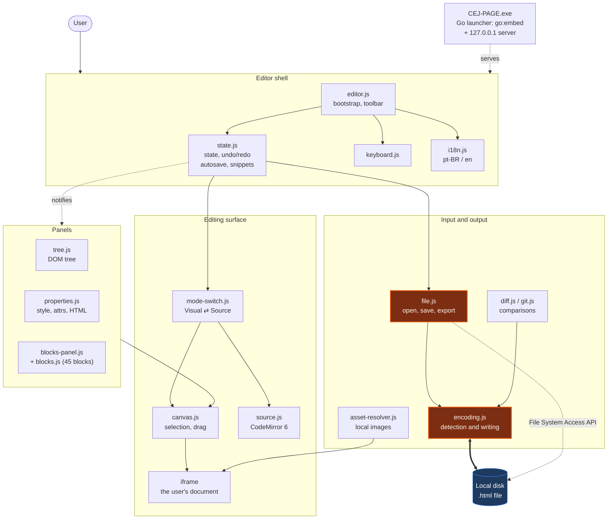
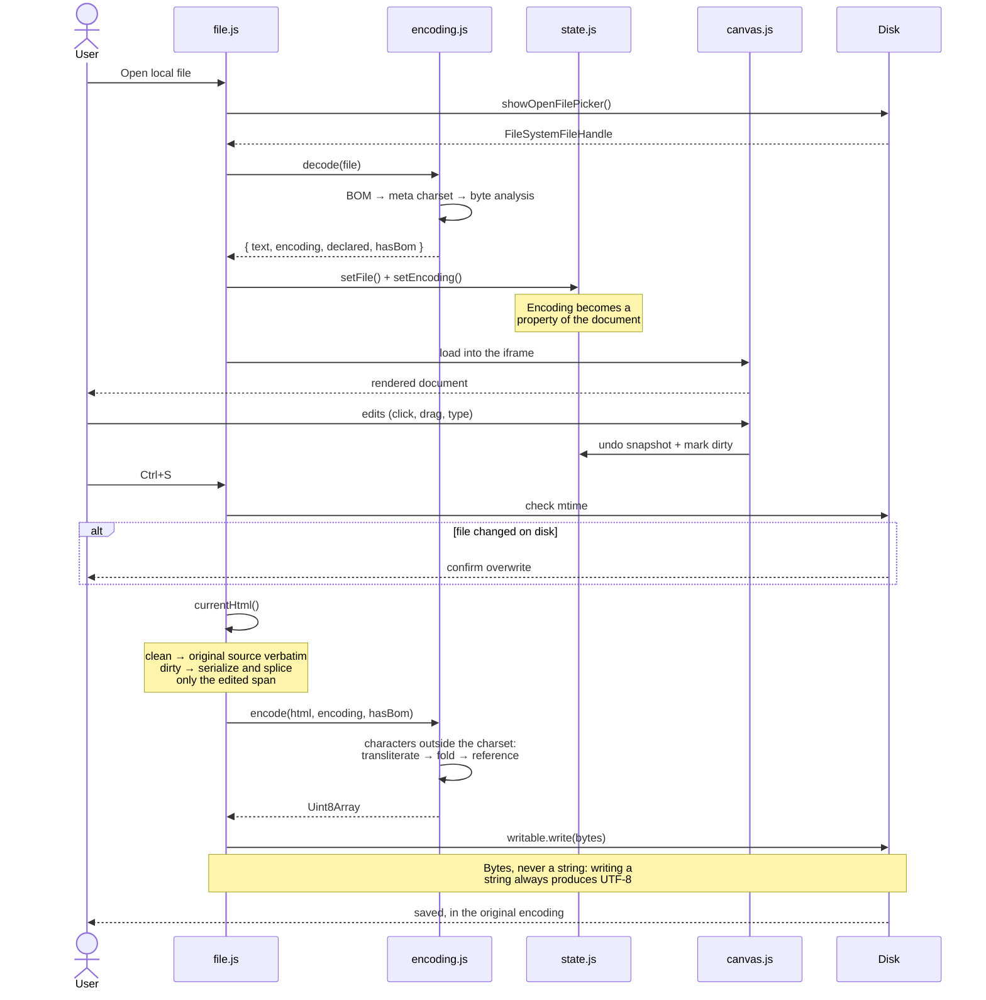
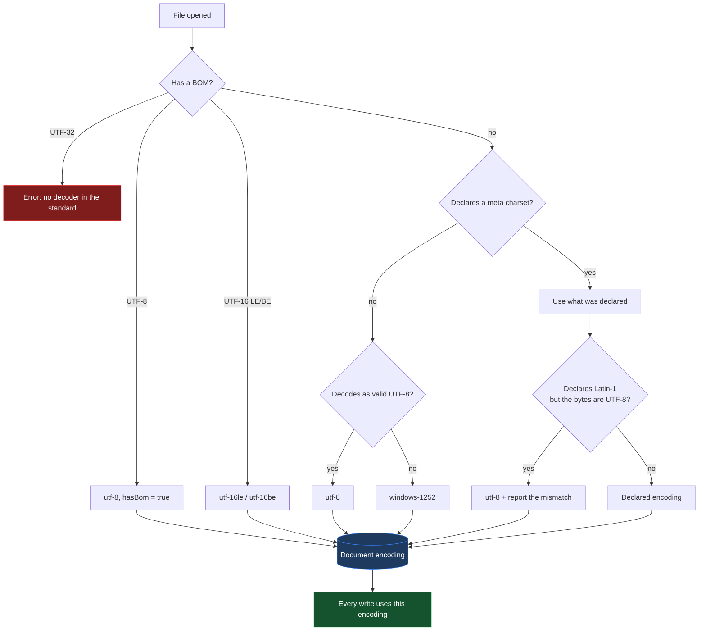

# CEJ-PAGE

[Português (Brasil)](README.md) · **English**

A browser-based visual HTML editor, built to edit legacy **ISO-8859-1 /
Windows-1252** documents without corrupting them.

---

## About

Brazilian federal legislation published by the *Planalto* and related systems
consists of old HTML pages, nearly all exported from Word and encoded in
Windows-1252. Modern tools tend to destroy them in one of two ways: the file is
written back as UTF-8 while still declaring `charset=windows-1252` — turning
every accented character into mojibake — or the editor reformats the whole
document, turning a one-line correction into a thousand-line diff.

CEJ-PAGE exists so those files can be edited like any other page, without the
file paying for it.

### Goals

| Goal | How it's met |
| --- | --- |
| Preserve the original encoding | The encoding detected on open becomes a property of the document and governs every write |
| Preserve the file outside the edited region | The `<head>` and every untouched span are copied verbatim from the original |
| Usable by non-technical staff | Single-file Windows executable: double-click, no installation |
| Work on a locked-down corporate network | Zero runtime dependencies; runs fully offline |
| Keep documents private | Everything runs locally; no file ever leaves the machine |

### Features

- **Visual editing** — click to select, drag to reorder, double-click to edit
  text in place.
- **Live save to disk** — a persistent handle to the file via the File System
  Access API; `Ctrl+S` writes straight back.
- **Encoding preserved** — detection by BOM, `<meta charset>` or byte analysis;
  byte-exact writing in the same encoding, with a toolbar chip and on-demand
  UTF-8 ↔ ISO-8859-1 conversion.
- **Source mode** — CodeMirror 6 with HTML highlighting, for fine control.
- **45 pre-built blocks** across 9 categories, draggable into the document.
- **DOM tree** panel with drag-to-reorder.
- **Properties panel** — typography, layout, spacing, background, border,
  effects, classes, attributes and raw HTML.
- **Diff** against the on-disk version and against Git `HEAD`.
- **Undo/redo**, autosave, reusable snippets and recent files.
- **Device preview** (desktop / tablet / mobile) and a clean preview mode.
- **Light and dark themes**, interface in Portuguese and English.

---

## Quick start

### Running on Windows (end user)

1. Download `CEJ-PAGE.exe` from [Releases](https://github.com/waldeyr/cej-editor/releases).
2. **Double-click** it.
3. The editor opens in your browser. **To stop it, close the black window.**

No installation, no administrator rights, no internet.

> On first run Windows may show *"Windows protected your PC"*, because the file
> carries no paid code-signing certificate. Click **More info** → **Run anyway**.

### Running from source

It's a static site — no build step, nothing to install.

```sh
git clone https://github.com/waldeyr/cej-editor.git
cd cej-editor
python3 -m http.server 8000        # or: npx serve .
```

Open `http://localhost:8000`. `localhost` counts as a secure context, so live
save to disk works in development too.

### Building the executable

Via GitHub Actions (recommended — nothing to install): **Actions** tab →
**Build Windows executable** → **Run workflow**. The `.exe` is attached to the
run.

Locally, with Go 1.24 or newer:

```sh
./tools/launcher/build.sh          # dist/CEJ-PAGE.exe
./tools/launcher/build.sh host     # binary for the current machine
```

### Checking

```sh
for f in js/*.js; do node --check "$f"; done
```

---

## Architecture

### Component diagram



Modules are plain JavaScript with no bundler. Each exposes a single object on
`window` (`window.Canvas`, `window.EditorState`, `window.Encoding`…) and state
changes flow through `EditorState.emit/on`. The critical encoding path is
highlighted in orange.

### Flow: open → edit → save



### Flow: encoding decision



### Features and rules

| Feature | Rule |
| --- | --- |
| Open local file | Persistent handle via the File System Access API. Requires Chrome, Edge or another Chromium browser in a secure context. |
| Import HTML | Read-only fallback for Safari and Firefox; saving becomes a download. |
| Save (`Ctrl+S`) | Writes in the document's encoding. Compares the on-disk mtime first; if another process changed the file, asks for confirmation. |
| Save as | **Keeps** the document's encoding — a copy of a Latin-1 file is Latin-1 too. |
| New blank document | Always UTF-8; never inherits the previous file's encoding. |
| Encoding detection | Precedence: BOM → `<meta charset>` → byte analysis with a strict `TextDecoder`. Undeclared and not valid UTF-8 means Windows-1252. |
| Writing | Always a `Uint8Array`. Writing a string through the File System Access API produces UTF-8 by spec — the exact bug this project fixes. |
| Characters outside the charset | Cascade: transliteration table (`→`→`->`, 🙂→`:-)`), diacritic folding (`ș`→`s`), numeric reference (`漢`→`&#28450;`). Inside `<script>`/`<style>` a language escape is used instead, since HTML references aren't parsed there. |
| Curly quotes, dashes, ellipsis | **Not** transliterated: they exist natively in Windows-1252 and are written back as their original byte. |
| Conversion via the chip | Moves the bytes and the `<meta charset>` together, and marks the document dirty. |
| `<head>` preservation | If the document's serialization doesn't diverge from the original, the source is returned verbatim. When it does, only the changed span is spliced into the original. |
| Visual mode | May normalize markup formatting on save, once edited. |
| Source mode | CodeMirror; content is written exactly as it stands in the buffer. |
| Undo/redo | Whole-document snapshots, capped at 50 entries or ~8 MB. |
| Autosave | `localStorage`, 2 s after the last change. Offered as "restore last session" on the empty screen. |
| Recent files | Last 8, by name. |
| Diff against disk / Git | Decodes the other side with the document's encoding, so mojibake isn't reported as a difference. |
| Local images | Resolved from a user-chosen folder and shown via `blob:`; original attributes are restored on save. |
| Preview | Desktop (full width), tablet (820 px), mobile (400 px). |
| Language | pt-BR by default; switchable to English, preference persisted. |
| Privacy | No network requests at runtime. No file leaves the machine. |

### Keyboard shortcuts

| Shortcut | Action |
| --- | --- |
| `Ctrl+S` | Save to the linked file (or export) |
| `Ctrl+Shift+S` | Save as |
| `Ctrl+Z` / `Ctrl+Shift+Z` / `Ctrl+Y` | Undo / redo |
| `Ctrl+D` | Duplicate selection |
| `Delete` / `Backspace` | Delete selection |
| `Ctrl+↑` / `Ctrl+↓` | Move selection up / down |
| `Esc` | Exit preview, or deselect |
| `P` | Toggle preview |
| Double-click | Edit text in place |
| `A` `B` `C` `R` | On the empty screen: open, import, start blank, restore |

### Technologies and versions

| Technology | Version | Role | Source |
| --- | --- | --- | --- |
| JavaScript (ES2022) | — | The entire application; no framework, no bundler | — |
| File System Access API | — | Linking to and writing the local file | Browser native |
| `TextDecoder` / `TextEncoder` | — | Decoding foundation; Windows-1252 encoding is implemented in-project | Browser native |
| CodeMirror | 6.0.1 | Source-mode editor | `vendor/esm/` |
| @codemirror/state | 6.4.1 | Editor state | `vendor/esm/` |
| @codemirror/view | 6.26.3 | Editor rendering | `vendor/esm/` |
| @codemirror/lang-html | 6.4.9 | HTML syntax highlighting | `vendor/esm/` |
| @codemirror/theme-one-dark | 6.1.2 | Source-mode dark theme | `vendor/esm/` |
| diff | 5.2.0 | Text comparison | `vendor/esm/` |
| isomorphic-git | 1.27.2 | Reading the repository `HEAD` | `vendor/esm/` |
| Lucide | 1.28.0 | Interface icons | `vendor/lucide.min.js` |
| Roboto | — | Typography (9 woff2 subsets) | `vendor/fonts/` |
| Go | 1.24+ | Launcher that produces `CEJ-PAGE.exe` | `tools/launcher/` |
| GitHub Actions | — | Executable build and Pages deployment | `.github/workflows/` |

Every library lives in [vendor/](vendor/) and is served by the application
itself. **No request leaves for the internet at runtime** — that's what makes
offline and restricted-network operation possible. Reintroducing a CDN reference
fails the release workflow.

### Directory layout

```
index.html              editor shell (toolbar + 3 panes + status bar)
css/editor.css          styles, light and dark themes
js/i18n.js              pt-BR / en strings (pt-BR is the default)
js/encoding.js          charset detection and byte-exact writing
js/state.js             global state, undo/redo, autosave, snippets
js/blocks.js            library of 45 components
js/canvas.js            iframe, selection, drag and drop
js/tree.js              DOM tree panel and breadcrumbs
js/properties.js        style, attribute and HTML tabs
js/blocks-panel.js      blocks and snippets sidebar
js/asset-resolver.js    local image resolution in preview
js/mode-switch.js       Visual ⇄ Source switching
js/source.js            CodeMirror integration
js/file.js              open, save, save as, export
js/diff.js              diff against the on-disk version
js/git.js               diff against Git HEAD
js/keyboard.js          global shortcuts
js/editor.js            bootstrap and interface wiring
js/dialog.js            confirmation and input dialogs
js/version.js           build version chip
vendor/                 embedded dependencies (offline operation)
tools/launcher/         Go program that produces CEJ-PAGE.exe
```

---

## Fork

This project is a fork of
**[mncoleman/html-editor](https://github.com/mncoleman/html-editor)**, created by
**[Matthew Coleman](https://mncoleman.com/)**.

The original visual editor — the iframe canvas, the DOM tree, the properties
panel, the block library and the File System Access integration — is their work,
released under the MIT license. Our thanks for building it and for making it
openly available; without that foundation CEJ-PAGE would not exist.

What this fork adds: legacy encoding preservation, Portuguese translation, an
interface stripped to essentials, removal of all external dependencies, and the
portable Windows executable.

## License

[MIT](LICENSE) — carried over from the original project, with its copyright
notice preserved.
