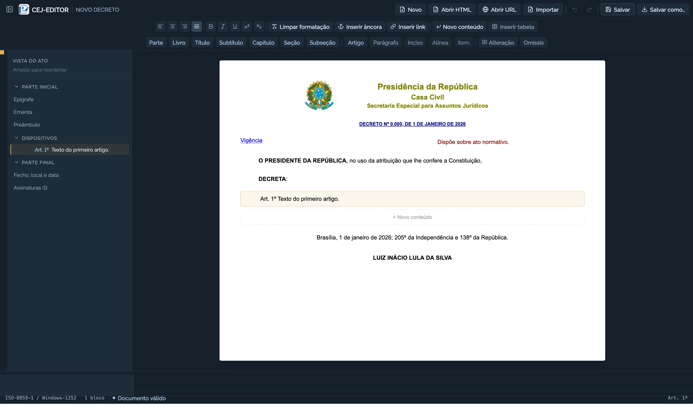

# CEJ-EDITOR

Editor de Atos Normativos desenvolvido para elaboração, importação, edição, validação e exportação de textos legislativos no padrão da Secretaria Especial para Assuntos Jurídicos (CEJ / Casa Civil da Presidência da República).

## Descrição do Projeto

O CEJ-EDITOR é uma aplicação Web e Desktop (Electron) destinada ao suporte à redação técnica legislativa. O sistema realiza a importação de arquivos RTF e DOCX, a estrutura de artigos, parágrafos, incisos e alíneas, a validação de regras formais de sequenciamento e a exportação em HTML conforme as diretrizes oficiais. Arquivos `.doc` que contenham RTF são aceitos; documentos Word binários legados devem ser convertidos para DOCX ou RTF antes da importação.

### Funcionalidades

- **Gerenciamento de Codificação de Caracteres**: Padrão de gravação definido como **ISO-8859-1 (Windows-1252)**, com opção de alteração para UTF-8 e UTF-16LE, garantindo a preservação de acentuação em sistemas legados.
- **Estruturação Sagitário**: Botões para inserção de agrupadores e dispositivos da estrutura legislativa (Parte, Livro, Título, Subtítulo, Capítulo, Seção, Subseção, Artigo, Parágrafo, Inciso, Alínea, Item, Alteração/Aspas e Omissis).
- **Alinhamento e Formatação de Texto**: Botões para alinhamento (à esquerda, centralizado, à direita e justificado), negrito, itálico, inserção de links externos e âncoras internas.
- **Edição Avançada de Tabelas**: Importação RTF de tabelas com mesclagem horizontal/vertical (`colspan`/`rowspan`), adição de células completando a coluna (à esquerda e à direita), mesclagem e separação (split) aplicadas à célula selecionada e redimensionamento individual.
- **Importação de Word**: Conversão local de documentos DOCX para HTML antes da classificação legislativa, preservando parágrafos e tabelas compatíveis.
- **Controle de Histórico**: Pilha de histórico para desfazer e refazer alterações (até 50 estados) via interface e atalhos de teclado (`Ctrl+Z` e `Ctrl+Y`).
- **Validação Normativa**: Verificação de consistência e sequenciamento numérico dos dispositivos em tempo real.

## Interface do Usuário



## Tecnologias e Versões

As versões abaixo são as declaradas no `package.json`. A integração contínua compila e testa o projeto com **Node.js 20**.

| Tecnologia | Versão | Função |
| :--- | :--- | :--- |
| **Node.js** | `>= 18.0.0` | Ambiente de execução JavaScript/TypeScript |
| **React** | `^18.2.0` | Biblioteca para construção de interfaces gráficas |
| **TypeScript** | `^5.3.3` | Linguagem para tipagem estática de código |
| **Vite** | `^5.1.4` | Ferramenta de build e servidor de desenvolvimento |
| **Electron** | `^29.1.0` | Framework para execução em ambiente desktop |
| **TailwindCSS** | `^4.0.0` | Framework utilitário para estilização CSS |
| **Lucide React** | `^0.344.0` | Conjunto de ícones para interface |
| **Mammoth** | `^1.12.1` | Conversão de DOCX para HTML na importação |
| **Vitest** | `^1.3.1` | Framework para testes unitários |
| **Esbuild** | `^0.20.1` | Bundler para scripts da camada Electron |

## Instalação e Execução

### Requisitos

Possuir o **Node.js** (versão 18 ou superior) e o **npm** instalados.

```bash
node -v
npm -v
```

### Instalação

```bash
# Clonar o repositório
git clone https://github.com/waldeyr/cej-editor.git

# Acessar o diretório
cd cej-editor

# Instalar dependências
npm install
```

### Execução em Desenvolvimento (Web)

```bash
npm run dev
```

A aplicação estará acessível em `http://localhost:3000` (porta definida em `vite.config.ts`).

### Execução dos Testes Unitários

```bash
npm test
```

### Compilação para Produção

```bash
npm run build
```

### Empacotamento Desktop (Electron)

```bash
npm run build:desktop
```

Os artefatos gerados serão salvos no diretório `dist-desktop/`.

## Licença

Este projeto está licenciado sob a licença [Apache 2.0](LICENSE).
