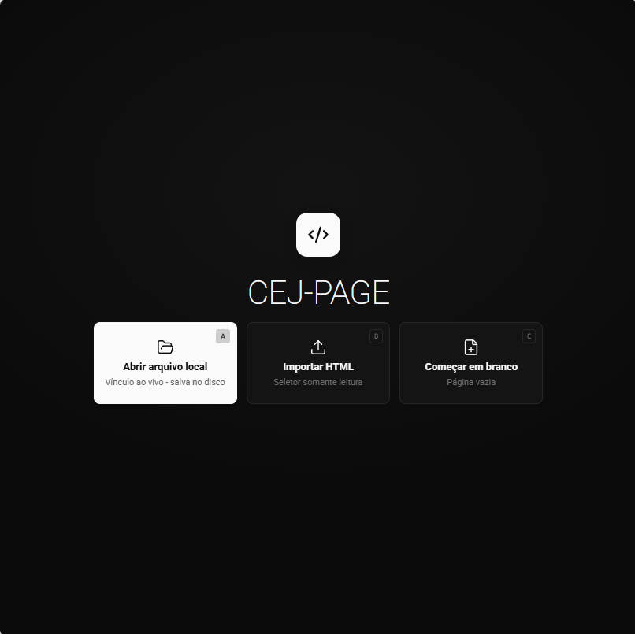
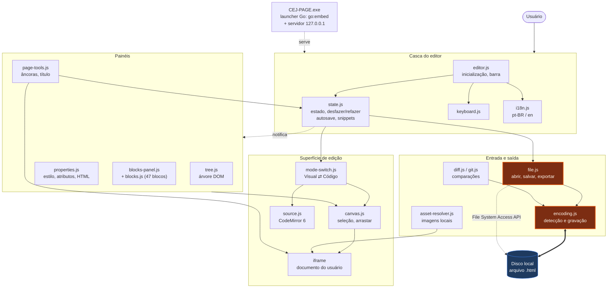
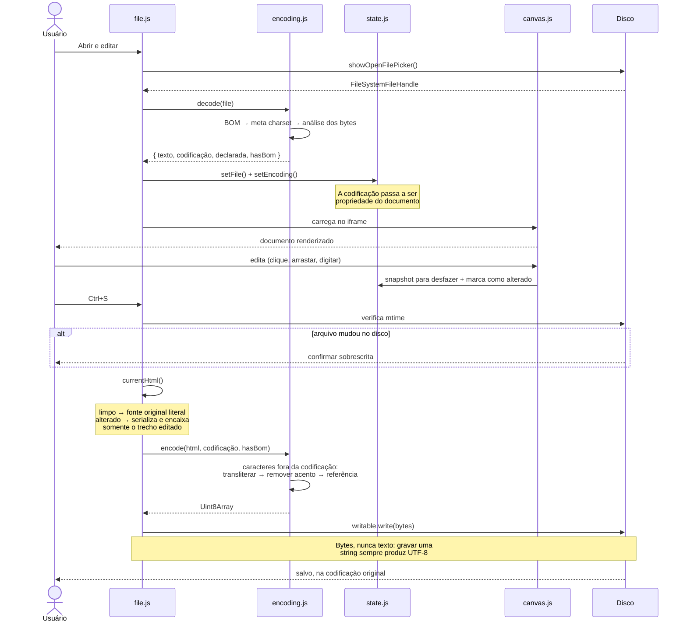
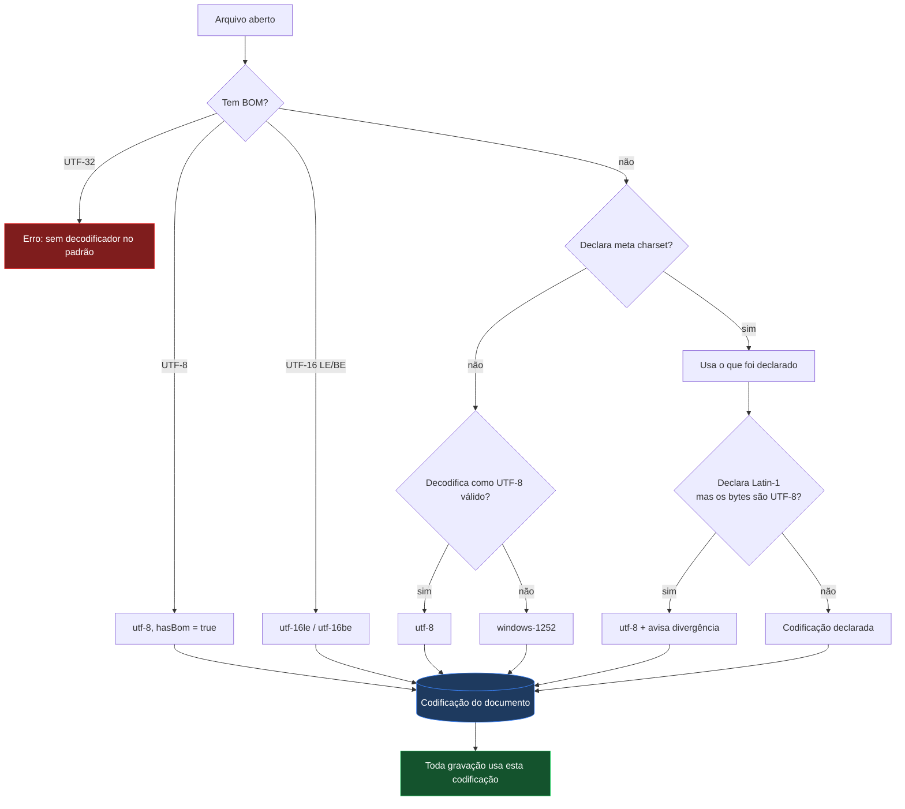
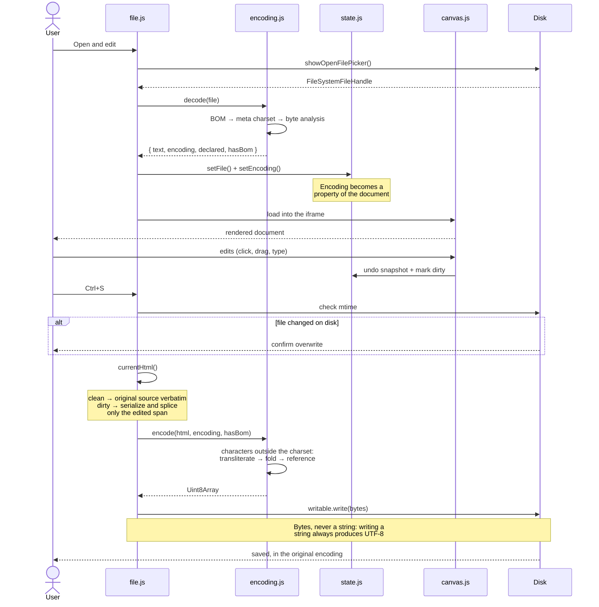
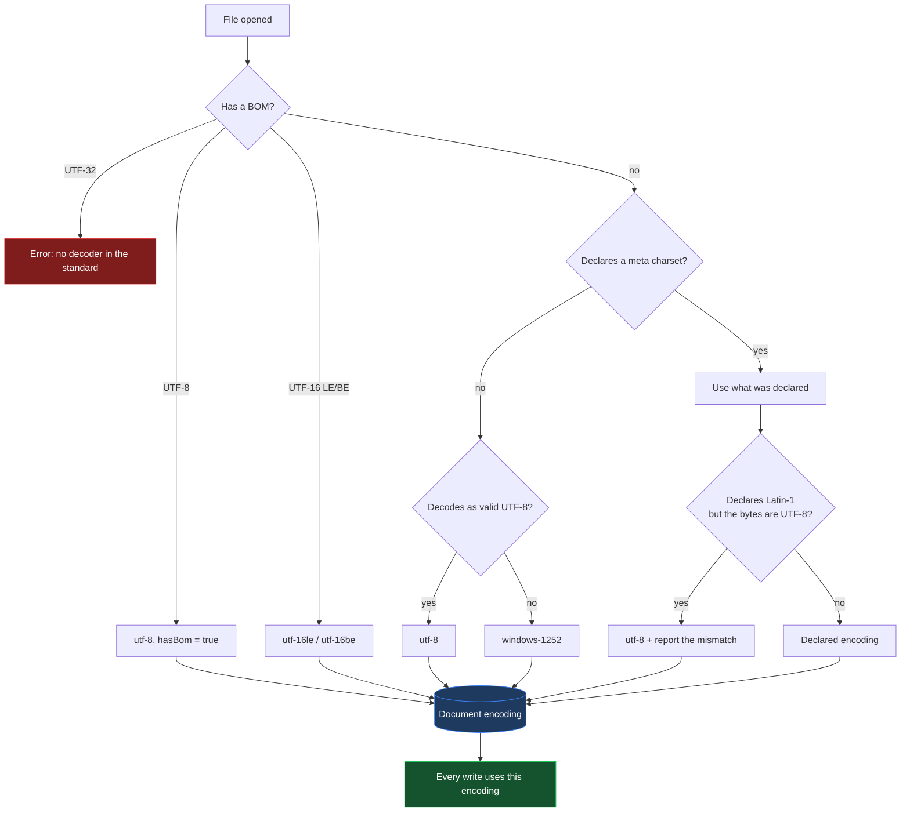

# CEJ-PAGE

[](LICENSE)
[](https://github.com/waldeyr/cej-editor/releases)
[](#tecnologias-e-versões)
[](#fluxo-decisão-de-codificação)

Editor visual de HTML/CSS que roda no navegador, criado para editar documentos
com diferentes encodings — incluindo **UTF-8, ISO-8859-1 e Windows-1252** — sem
corrompê-los.

<p>
  <a href="#sobre-o-projeto">🇧🇷 Português</a>
  &nbsp;·&nbsp;
  <a href="#about">🇬🇧 English</a>
</p>

---

## Pré-visualização



## Sobre o projeto

Documentos HTML antigos, muitas vezes exportados do Word, podem usar encodings
que ferramentas modernas não preservam corretamente. O arquivo pode ser gravado
em UTF-8 enquanto continua declarando `charset=windows-1252` — e todo acento vira
mojibake — ou o editor pode reformatá-lo inteiro, transformando uma correção de
uma linha num diff de mil linhas.

O CEJ-PAGE existe para editar esses arquivos como se fosse um editor visual
comum, sem que o arquivo pague o preço.

### Objetivos

| Objetivo | Como é atendido |
| --- | --- |
| Preservar a codificação original | A codificação detectada na abertura vira propriedade do documento e governa toda gravação |
| Preservar o arquivo fora da região editada | O `<head>` e todo trecho não tocado são copiados literalmente do original |
| Ser usável por quem não é da área técnica | Executável único para Windows: duplo clique, sem instalação |
| Funcionar em rede corporativa restrita | Zero dependências externas em tempo de execução; roda offline |
| Não expor os documentos | Tudo roda localmente; nenhum arquivo sai da máquina |

### Funcionalidades

#### Para quem redige atos normativos

Estes recursos falam o vocabulário do ato, não o do CSS. Todo texto que o editor
escreve sai **na mesma marcação dos atos já publicados**, byte a byte — um
parágrafo criado aqui é indistinguível dos que o Word produziu em 2003.

- **Barra de formatação do ato** — uma faixa de fichas logo abaixo da barra
  superior: Epígrafe, Ementa, Preâmbulo, Corpo, Artigo, Parágrafo, Inciso,
  Alínea, Citação de outro ato, Data e local, Assinaturas, Nota do DOU, Título
  de anexo. Selecione um trecho e clique — o editor aplica a receita de
  formatação correspondente e, no caso do artigo, numera e cria a âncora.
  Atalho `Ctrl+Alt+1..9`.
  A ficha do trecho em que o cursor está acende sozinha, e um selo ao lado diz
  o que ele é ("Art. 3º") e o que falta ("sem âncora").
- **Colar do Word** (`Ctrl+Shift+V`, ou colar direto no texto) — o texto vem do
  Word cheio de `mso-`, `<o:p>`, `class="Mso…"` e comentários condicionais.
  O editor reduz tudo a parágrafos limpos, reconhece "Art. 5º", "§ 2º",
  "III -", "c)" e aplica a formatação de cada um. Negrito, itálico e links são
  preservados; o resto é descartado. O relatório diz exatamente o que aconteceu.
- **Link para outro ato** (`Ctrl+K`) — selecione o texto, cole o endereço, e o
  editor lê o endereço de volta em português: *"Decreto nº 12.846, de 2026 —
  art. 11, inciso II, alínea f"*. Também lista os dispositivos e as âncoras
  desta página para escolher como destino, e guarda os endereços recentes.
- **Conferir links** — aponta links para âncoras inexistentes, links para o
  próprio ato pelo endereço completo (que quebram em silêncio quando um
  âncora é renomeada), `http://` e endereços vazios.
- **Estrutura do ato** — a primeira aba da barra esquerda mostra o documento como
  quem redige o lê: Epígrafe, Ementa, Art. 1º, § 1º, Anexo I. Clicar salta até
  lá. Artigos sem âncora aparecem marcados.
- **Este trecho** — a aba padrão da barra direita, em português comum: o que é o
  trecho, se a formatação está no padrão, os links que ele contém, a âncora,
  e botões grandes para as ações. As abas técnicas (Atributos, Estilo, HTML)
  continuam ali, uma aba adiante, em **Avançado**.
- **Conferência final do ato** — artigos sem âncora, links quebrados, falta da
  nota do DOU, título da página igual ao nome do arquivo, resíduos do Word,
  caracteres fora da codificação. É um relatório: corrige só item a item, e
  apenas quando a correção é inequívoca.
- **Novo ato a partir de um ato existente** — cole o endereço de um ato do
  portal; o editor abre, oferece apagar o corpo e os anexos, e mantém o
  cabeçalho, o preâmbulo e as assinaturas como modelo.
- **Marcas de revisão** — âncoras, links, fim de parágrafo (¶) e uma faixa
  colorida na margem indicando o papel de cada parágrafo. Tudo é CSS injetado no
  editor: não desloca o layout e **nunca** vai para o arquivo salvo.

#### Edição geral

- **Edição visual** — clicar para selecionar, arrastar para reordenar, clique
  duplo para editar texto no lugar. Selecionar texto e apertar `Delete` (ou o
  botão de lixeira) apaga só o trecho selecionado, como no FrontPage.
- **Âncoras** — o que o FrontPage chamava de "Indicador": marca um trecho para
  que um link aponte direto para ele (`pagina.html#nome-da-ancora`), com um
  gerenciador que lista, localiza, renomeia e remove as âncoras da página.
  Renomear atualiza os links internos que apontavam para ele.
- **Título da página** — define o `<head><title>` sem precisar entrar no modo
  código.
- **Marca visual das âncoras** — mostra no canvas onde estão as âncoras da
  página, inclusive as invisíveis (`<a name>` vazio). É desenhada com `outline`,
  então não desloca o layout, e existe só no editor: nunca vai para o arquivo
  salvo. Fica no menu **Marcas**, junto das demais marcas de revisão.
- **Estilos do documento** — em **Avançado → Atributos**, a lista das classes
  que o próprio arquivo já define no `<style>` (`span.Hiperlink`, `.font5`,
  `table.MsoNormalTable`…), agrupadas pela tag a que pertencem. Serve para
  páginas comuns; para atos normativos, use a barra de formatação do ato.
- **Gravação direta no disco** — vínculo persistente com o arquivo via File
  System Access API; `Ctrl+S` grava por cima. Em navegadores sem essa API
  (Firefox), **Salvar como** pergunta o nome antes de baixar.
- **Importação por URL** — baixa uma página HTML acessível por CORS para edição
  local; use **Exportar** ou **Salvar como** para gravar uma cópia. Sites que
  bloqueiam leitura cross-origin devem ser baixados manualmente e importados
  pelo botão **Importar**.
- **Codificação preservada** — detecção por BOM, `<meta charset>` ou análise dos
  bytes; gravação byte a byte na mesma codificação, com selo na barra e conversão
  UTF-8 ↔ ISO-8859-1 sob demanda.
- **Modo código** — CodeMirror 6 com realce de HTML, para controle fino.
- **Painel de peças** — as peças do ato (que escrevem a marcação padrão) num
  grupo aberto, e a biblioteca de blocos web genéricos num grupo **Avançado**
  recolhido. A busca alcança os dois.
- **Árvore DOM** navegável, com arrastar para reordenar.
- **Painel de propriedades** — tipografia, layout, espaçamento, fundo, borda,
  efeitos, classes, atributos e HTML bruto.
- **Comparação** com a versão em disco e com o `HEAD` do Git.
- **Desfazer/refazer**, autosave, snippets reutilizáveis e arquivos recentes.
- **Pré-visualização** por dispositivo (desktop / tablet / celular) e modo limpo.
- **Temas claro e escuro**, interface em português e inglês.

---

## Quick-Start

### Usar no Windows (usuário final)

1. Baixe o `cej-page-vX.Y.exe` mais recente em [Releases](https://github.com/waldeyr/cej-editor/releases)
   — o nome traz a versão, para você saber qual build está rodando.
2. Dê **duplo clique**.
3. O editor abre no navegador. **Para encerrar, feche a janela preta.**

Sem instalação, sem privilégio de administrador, sem internet.

> Na primeira execução o Windows pode exibir *"O Windows protegeu o seu
> computador"*, porque o arquivo não tem assinatura digital paga. Clique em
> **Mais informações** → **Executar assim mesmo**.

### Rodar depois de clonar

É um site estático: não há etapa de build, nem dependências a instalar. Basta
servir a pasta por HTTP e abrir no navegador.

```sh
git clone https://github.com/waldeyr/cej-editor.git
cd cej-editor
```

Escolha **qualquer uma** destas — use a que já estiver na sua máquina:

| Se você tem | Comando |
| --- | --- |
| Python 3 | `python3 -m http.server 8000` |
| Node.js | `npx serve . -l 8000` |
| PHP | `php -S localhost:8000` |
| Ruby | `ruby -run -e httpd . -p 8000` |
| Go 1.24+ | `./tools/launcher/build.sh host && ./dist/cej-page` |
| VS Code | extensão *Live Server* → botão **Go Live** |

Depois abra `http://localhost:8000`.

> **Não abra o `index.html` com duplo clique.** Em `file://` o navegador
> bloqueia a File System Access API (a gravação em disco) e não resolve o
> importmap dos módulos. Já `http://localhost` conta como contexto seguro,
> então servindo a pasta tudo funciona, inclusive salvar direto no arquivo.

Qualquer servidor estático serve, desde que entregue arquivos `.mjs` com um
tipo MIME de JavaScript — os seis acima foram verificados. Um servidor que
devolva `.mjs` como `text/plain` faz o navegador recusar os módulos
carregados sob demanda, quebrando o modo código e as comparações.

### Gerar o executável

Pelo GitHub Actions (recomendado — não exige nada instalado): aba **Actions** →
**Build Windows executable** → **Run workflow**. O `.exe` fica anexado ao
resultado.

Localmente, com Go 1.24 ou superior (`brew install go`):

```sh
./tools/launcher/build.sh          # dist/CEJ-PAGE.exe
./tools/launcher/build.sh host     # binário para a máquina atual
```

O Go é necessário **apenas** para gerar o executável — não para rodar o editor.

### Verificar

```sh
for f in js/*.js; do node --check "$f"; done
```

---

## Arquitetura

### Diagrama de componentes



Os módulos são JavaScript puro, sem empacotador. Cada um expõe um objeto único
em `window` (`window.Canvas`, `window.EditorState`, `window.Encoding`…) e as
mudanças de estado circulam por `EditorState.emit/on`. Em laranja, o caminho
crítico de codificação.

### Fluxo: abrir → editar → salvar



### Fluxo: decisão de codificação



### Funcionalidades e regras

| Funcionalidade | Regra de funcionamento |
| --- | --- |
| Abrir e editar | Vínculo persistente com o arquivo via File System Access API: `Ctrl+S` grava por cima dele, e os botões de recarregar/comparar ficam disponíveis. Exige Chrome, Edge ou outro navegador Chromium em contexto seguro; nos demais, cai sozinho em *Abrir uma cópia*. |
| Abrir uma cópia | Abre o conteúdo **sem vínculo** com o arquivo: `Ctrl+S` pergunta onde gravar, e recarregar/comparar ficam desabilitados. É o caminho do Safari e do Firefox, e o da importação por URL. |
| Arrastar um arquivo para a janela | Equivale a *Abrir e editar*: o Chrome resolve o item arrastado num handle real (`DataTransferItem.getAsFileSystemHandle()`), então o vínculo com o disco é mantido. Onde a API não existe, abre como cópia. |
| Salvar (`Ctrl+S`) | Grava na codificação do documento. Antes de escrever compara o mtime do disco; se outro processo alterou o arquivo, pede confirmação. |
| Salvar como | **Mantém** a codificação do documento — a cópia de um arquivo Latin-1 também é Latin-1. Sempre pergunta onde/como salvar: janela nativa no Chrome/Edge; nos demais (Firefox), um diálogo pedindo o nome, seguido do download. Cancelar não baixa nada. |
| Salvar como no Firefox | O Firefox não permite que a página abra a janela "Salvar em" do Windows. Para escolher a pasta a cada salvamento, ligue uma vez em *Menu ≡ → Configurações → Geral → Downloads → "Sempre perguntar onde salvar arquivos"*. O editor mostra esse aviso uma única vez. |
| Âncora | Com texto selecionado, envolve o trecho em `<a name="x">` — só `name`, como fazem os atos publicados (as 1.219 âncoras da Lei 8.112 consolidada não têm `id`). Com um elemento selecionado, insere a marca como primeiro filho dele. Seleção que atravessa mais de um bloco insere só uma marca vazia, para não colocar blocos dentro de um link. O nome segue a gramática do portal — acentos removidos, espaços viram `-`, **o `§` é preservado** (`art3§1`) e o nome é tornado único. Nos links o `§` sai percent-encoded (`#art3%C2%A71`). |
| Remover âncora | Nunca apaga conteúdo: uma marca `<a name>` sem `href` é desembrulhada preservando o texto; nos demais casos só o atributo é removido. |
| Título da página | Grava em `<head><title>` com `textContent`, então `&` e `<` são escapados. Cria `<title>` (e `<head>`) se não existirem. |
| Marcas de revisão | Uma única folha de estilo injetada no iframe (`__he_marks__`), removida na gravação junto com as demais marcas do editor. Nenhum atributo é escrito no documento, então nenhuma marca suja o arquivo nem aciona o autosave. Âncoras: `<a name>` vazio ganha selo ⚓, os demais contorno tracejado. Links ganham fundo e um sinal de interno/externo. Parágrafos ganham ¶ (fora de tabelas). Papéis do ato ganham faixa colorida na margem via `box-shadow`, que não ocupa espaço de layout. |
| Formatação do ato | Cada papel (Epígrafe, Ementa, Artigo, Inciso…) é uma receita declarativa em `js/act-format.js` — a mesma marcação em linha dos atos publicados. Nenhum outro arquivo do projeto contém a literal `10.0pt`; trocar o padrão de publicação é editar um arquivo só. |
| Reconhecimento do papel | Comparação normalizada, não textual: as duas grafias que convivem no corpus (`font-family: Arial,sans-serif` e `font-family:&quot;Arial&quot;,sans-serif`) contam como iguais; `mso-*` é ignorado e `0cm`/`.0001pt`/`0px` valem `0`. Contradição em `text-align` ou `text-indent` desqualifica — sem isso, os 2.328 parágrafos alinhados à direita dos anexos seriam lidos como dispositivos do ato. |
| Varredura da estrutura | Rejeita subárvores `<table>`: os anexos guardam 6.640 dos 6.798 parágrafos do ato de exemplo, e entrar neles afogaria os 4 artigos. Nenhum parágrafo dentro de tabela é lido como dispositivo. |
| Colar do Word | O HTML da área de transferência é lido **sincronamente** (o `clipboardData` morre ao fim do handler) e analisado com `DOMParser`, que é inerte por especificação. Todos os atributos são descartados exceto `href`/`name`; sobrevivem negrito, itálico, sobrescrito, subscrito e links `http(s)`/`mailto`/`#`. Caracteres invisíveis (largura zero, hífen suave, BOM) são removidos; aspas curvas, travessões e o espaço não separável são mantidos, porque são a convenção. |
| Conferência final | Somente leitura, exceto correções de item único e inequívocas (`http:`→`https:`, auto-absoluto→fragmento). Um botão "corrigir tudo" seria um normalizador do documento inteiro, que é justamente o que a garantia de bytes proíbe. |
| Novo ato a partir do portal | Depois de esvaziar, o `sourceHtml` é refeito e o vínculo com o arquivo é solto. Sem isso, todo salvamento seguinte pediria ao encaixe que alinhasse um corpo esvaziado contra o original de 3,4 MB, e reescreveria o arquivo inteiro. |
| Estilos do documento | Lidos do CSSOM (`document.styleSheets`), inclusive dentro de `@media`. Folhas do editor e folhas cross-origin são ignoradas. A classe é extraída do último composto do seletor, então `div.Section1 span.texto8` conta como estilo de `span`. |
| Novo documento em branco | Sempre UTF-8; não herda a codificação do arquivo anterior. |
| Detecção de codificação | Precedência: BOM → `<meta charset>` → análise dos bytes com `TextDecoder` estrito. Sem declaração e sem UTF-8 válido, assume Windows-1252. |
| Gravação | Sempre `Uint8Array`. Gravar uma string pela File System Access API produz UTF-8 por especificação — é a origem do bug que o projeto corrige. |
| Caracteres fora da codificação | Cascata: tabela de transliteração (`→`→`->`, 🙂→`:-)`), remoção de diacrítico (`ș`→`s`), referência numérica (`漢`→`&#28450;`). Dentro de `<script>`/`<style>` usa escape da linguagem, porque ali referências HTML não são interpretadas. |
| Aspas curvas, travessões, reticências | **Não** são transliterados: existem nativamente no Windows-1252 e são gravados com o mesmo byte de origem. |
| Conversão pelo selo | Move os bytes e a `<meta charset>` juntos, e marca o documento como alterado. |
| Preservação do `<head>` | Se a serialização do documento não diverge do original, a fonte é devolvida literalmente. Divergindo, apenas o trecho alterado é encaixado no original. |
| Modo Visual | Pode normalizar a formatação da marcação ao salvar, quando há edição. Formatar um parágrafo pela barra do ato reescreve só aquele parágrafo: medido no ato de 3,4 MB, 79 caracteres de 3.437.674. |
| Modo Código | CodeMirror; o conteúdo é gravado exatamente como está no buffer. |
| Desfazer/refazer | Snapshots do documento inteiro, limitados a 50 entradas ou ~8 MB. |
| Autosave | `localStorage`, 2 s após a última alteração. Oferecido como "Restaurar última sessão" na tela inicial. |
| Arquivos recentes | Últimos 8, por nome. |
| Comparação com o disco / Git | Decodifica o outro lado com a mesma codificação do documento, para não exibir mojibake como diferença. |
| Imagens locais | Resolvidas por pasta escolhida pelo usuário e exibidas via `blob:`; os atributos originais são restaurados ao salvar. |
| Pré-visualização | Desktop (largura total), tablet (820 px), celular (400 px). |
| Idioma | pt-BR por padrão; alternável para inglês, preferência persistida. |
| Privacidade | Nenhuma requisição de rede em tempo de execução. Nenhum arquivo sai da máquina. |

### Vindo do Microsoft FrontPage

Equivalências para quem está migrando:

| No FrontPage | No CEJ-PAGE |
| --- | --- |
| Selecionar texto + `Delete` | Igual — apaga só o trecho selecionado |
| Colar texto do Word | `Ctrl+Shift+V`, ou colar direto no texto: o editor limpa a marcação do Word e formata cada parágrafo |
| Inserir → Âncora | Peças → **Ferramentas** → **Âncora**, ou o botão *Criar âncora* na aba **Este trecho** |
| Inserir → Hiperlink | `Ctrl+K`, ou o botão **Link** na barra do ato |
| Arquivo → Propriedades da página → Título | Peças → **Ferramentas** → **Título da página** |
| Formatar → Estilo (lista de estilos) | **Barra do ato**: as fichas Epígrafe, Ementa, Artigo, Inciso… |
| Formatar → Fonte / Parágrafo | Aba **Avançado** → **Estilo**, no painel da direita |
| Exibir → Marcas de formatação | Botão de marcador na barra superior: âncoras, ¶, links, papéis |
| Exibir → HTML | Botão **Código**, na barra superior à esquerda |
| Tabela → Inserir linha/coluna | Botões que aparecem na barra flutuante ao selecionar uma célula |

### Atalhos de teclado

| Atalho | Ação |
| --- | --- |
| `Ctrl+S` | Salvar no arquivo vinculado; sem vínculo, pergunta o nome e baixa |
| `Ctrl+Shift+S` | Salvar como |
| `Ctrl+K` | Transformar o texto selecionado em link |
| `Ctrl+Shift+V` | Colar texto do Word, limpo e formatado |
| `Ctrl+Alt+1`…`9` | Aplicar o papel do ato correspondente à ficha (Epígrafe, Ementa, Artigo…). `Ctrl+1..9` não serve: o navegador o reserva para trocar de aba |
| `Ctrl+Z` / `Ctrl+Shift+Z` / `Ctrl+Y` | Desfazer / refazer |
| `Ctrl+D` | Duplicar seleção |
| `Delete` / `Backspace` | Excluir o texto selecionado; sem seleção de texto, exclui o elemento. Funciona também com o cursor dentro da área de edição |
| `Ctrl+↑` / `Ctrl+↓` | Mover seleção para cima / baixo |
| `Esc` | Sair da pré-visualização, ou desselecionar |
| `P` | Alternar pré-visualização |
| Clique duplo | Editar texto no lugar |
| `A` `B` `C` `N` `R` | Na tela inicial: abrir, importar, começar em branco, novo ato a partir de um ato existente, restaurar |

### Tecnologias e versões

| Tecnologia | Versão | Papel | Origem |
| --- | --- | --- | --- |
| JavaScript (ES2022) | — | Toda a aplicação; sem framework e sem empacotador | — |
| File System Access API | — | Vínculo e gravação no disco local | Nativa do navegador |
| `TextDecoder` / `TextEncoder` | — | Base da decodificação; a codificação Windows-1252 é implementada no projeto | Nativa do navegador |
| CodeMirror | 6.0.1 | Editor do modo código | `vendor/esm/` |
| @codemirror/state | 6.4.1 | Estado do editor de código | `vendor/esm/` |
| @codemirror/view | 6.26.3 | Renderização do editor de código | `vendor/esm/` |
| @codemirror/lang-html | 6.4.9 | Realce de sintaxe HTML | `vendor/esm/` |
| @codemirror/theme-one-dark | 6.1.2 | Tema escuro do modo código | `vendor/esm/` |
| diff | 5.2.0 | Comparação textual | `vendor/esm/` |
| isomorphic-git | 1.27.2 | Leitura do `HEAD` do repositório | `vendor/esm/` |
| Lucide | 1.28.0 | Ícones da interface | `vendor/lucide.min.js` |
| Roboto | — | Tipografia (9 subconjuntos woff2) | `vendor/fonts/` |
| Go | 1.24+ | Launcher que gera o `CEJ-PAGE.exe` | `tools/launcher/` |
| GitHub Actions | — | Compilação do executável e publicação no Pages | `.github/workflows/` |

Todas as bibliotecas ficam em [vendor/](vendor/) e são servidas pela própria
aplicação. **Nenhuma requisição sai para a internet em tempo de execução** — é o
que permite o funcionamento offline e dentro de redes restritas. Reintroduzir uma
referência a CDN faz o workflow de release falhar.

### Estrutura de diretórios

```
index.html              casca do editor (barra + 3 painéis + rodapé)
css/editor.css          estilos, temas claro e escuro
js/i18n.js              textos pt-BR / en (pt-BR é o padrão)
js/encoding.js          detecção de codificação e gravação byte a byte
js/state.js             estado global, desfazer/refazer, autosave, snippets
js/blocks.js            biblioteca de 47 componentes + blocos-ação
js/canvas.js            iframe, seleção, exclusão de texto, arrastar e soltar
js/page-tools.js        âncoras e título da página
js/tree.js              painel da árvore DOM e breadcrumbs
js/properties.js        abas de estilo, atributos e HTML
js/blocks-panel.js      barra lateral de blocos e snippets
js/asset-resolver.js    resolução de imagens locais na pré-visualização
js/mode-switch.js       alternância Visual ⇄ Código
js/source.js            integração com o CodeMirror
js/file.js              abrir, salvar, salvar como, exportar
js/diff.js              comparação com a versão em disco
js/git.js               comparação com o HEAD do Git
js/keyboard.js          atalhos globais
js/editor.js            inicialização e ligação da interface
js/dialog.js            diálogos de confirmação e entrada
js/version.js           selo de versão do build
vendor/                 bibliotecas embutidas (funcionamento offline)
tools/launcher/         programa Go que gera o CEJ-PAGE.exe
```

---

## Fork

Este projeto é um fork de
**[mncoleman/html-editor](https://github.com/mncoleman/html-editor)**, criado por
**[Matthew Coleman](https://mncoleman.com/)**.

O editor visual original — o canvas em iframe, a árvore DOM, o painel de
propriedades, a biblioteca de blocos e a integração com a File System Access API —
é trabalho dele, publicado sob licença MIT. Nossa gratidão pelo projeto e por
disponibilizá-lo abertamente; sem essa base, o CEJ-PAGE não existiria.

O que este fork acrescentou: preservação de codificação legada, tradução para
português, redução da interface ao essencial, eliminação das dependências
externas e o executável portátil para Windows.

## Licença

[MIT](LICENSE) — mantida do projeto original, com o aviso de copyright
correspondente preservado.


---

<details>
<summary><b>&nbsp;🇬🇧&nbsp; English version</b> &nbsp;— click to expand</summary>

<br>

A browser-based visual HTML/CSS editor, built to edit documents using different
encodings — including **UTF-8, ISO-8859-1 and Windows-1252** — without corrupting
them.

---

## About

Legacy HTML documents, often exported from Word, may use encodings that modern
tools do not preserve correctly. The file may be written back as UTF-8 while
still declaring `charset=windows-1252` — turning every accented character into
mojibake — or the editor may reformat the whole document, turning a one-line
correction into a thousand-line diff.

CEJ-PAGE exists so those files can be edited like any other page, without the
file paying for it.

### Goals

| Goal | How it's met |
| --- | --- |
| Preserve the original encoding | The encoding detected on open becomes a property of the document and governs every write |
| Preserve the file outside the edited region | The `<head>` and every untouched span are copied verbatim from the original |
| Usable by non-technical staff | Single-file Windows executable: double-click, no installation |
| Work on a locked-down corporate network | Zero runtime dependencies; runs fully offline |
| Keep documents private | Everything runs locally; no file ever leaves the machine |

### Features

#### For people drafting normative acts

These speak the vocabulary of the act, not of CSS. Every piece of text the
editor writes comes out **in the same markup the published acts already use**,
byte for byte — a paragraph created here is indistinguishable from the ones
Word produced in 2003.

- **Act formatting bar** — a row of chips just below the top toolbar: Heading,
  Summary, Preamble, Body, Article, Paragraph, Item, Sub-item, Quote from
  another act, Date and place, Signatures, Gazette note, Annex title. Select a
  passage and click — the editor applies the matching recipe and, for an
  article, numbers it and creates the bookmark. Shortcut `Ctrl+Alt+1..9`.
  The chip for whatever the caret is in lights up on its own, and a pill beside
  it says what the passage is ("Art. 3º") and what it is missing ("no bookmark").
- **Paste from Word** (`Ctrl+Shift+V`, or paste straight into the text) — text
  arrives from Word carrying `mso-`, `<o:p>`, `class="Mso…"` and conditional
  comments. The editor reduces it to clean paragraphs, recognises "Art. 5º",
  "§ 2º", "III -", "c)" and formats each one. Bold, italics and links survive;
  the rest is discarded. The report says exactly what happened.
- **Link to another act** (`Ctrl+K`) — select the text, paste the address, and
  the editor reads that address back in plain language: *"Decreto nº 12.846, de
  2026 — art. 11, inciso II, alínea f"*. It also lists this page's provisions
  and bookmarks to pick as a target, and remembers recent addresses.
- **Check links** — flags links to bookmarks that do not exist, links to this
  act by its full address (which break silently when a bookmark is renamed),
  `http://`, and empty targets.
- **Act structure** — the first tab in the left panel shows the document the way
  a drafter reads it: Heading, Summary, Art. 1º, § 1º, Annex I. Clicking jumps
  there. Articles without a bookmark are marked.
- **This passage** — the default tab in the right panel, in plain language: what
  the passage is, whether its formatting matches the pattern, the links it
  contains, its bookmark, and large buttons for the actions. The technical tabs
  (Attributes, Style, HTML) are still there, one tab over, under **Advanced**.
- **Final check of the act** — articles with no bookmark, broken links, a
  missing gazette note, a page title that is just the file name, Word leftovers,
  characters outside the file's encoding. It is a report: it fixes only item by
  item, and only where the fix is unambiguous.
- **New act from an existing act** — paste the address of an act on the portal;
  the editor opens it, offers to delete the body and the annexes, and keeps the
  header, preamble and signatures as a model.
- **Revision marks** — bookmarks, links, paragraph ends (¶) and a colour rail in
  the margin showing each paragraph's role. All of it is CSS injected into the
  editor: it does not shift the layout and **never** reaches the saved file.

#### General editing

- **Visual editing** — click to select, drag to reorder, double-click to edit
  text in place. Selecting text and pressing `Delete` (or the trash button)
  removes just that text, the way FrontPage did.
- **Bookmarks (anchors)** — FrontPage's "Bookmark": mark a spot so a link can
  point straight at it (`page.html#bookmark`), with a manager that lists,
  locates, renames and removes the page's bookmarks. Renaming rewrites the
  in-page links that pointed at it.
- **Page title** — sets `<head><title>` without dropping into source mode.
- **Visual bookmark markers** — shows where the page's anchors are on the
  canvas, including the invisible ones (empty `<a name>`). Drawn with `outline`,
  so it never shifts the layout, and it lives in the editor only: it never
  reaches the saved file. Toggled by the bookmark button in the toolbar.
- **Document styles** — the **Attributes** tab lists the classes the file itself
  already defines in its `<style>` (`span.Hiperlink`, `.font5`,
  `table.MsoNormalTable`…), grouped by the tag they belong to. Pages exported
  from Word/FrontPage carry dozens; applying one becomes picking from a list
  instead of remembering its name.
- **Live save to disk** — a persistent handle to the file via the File System
  Access API; `Ctrl+S` writes straight back. In browsers without that API
  (Firefox), **Save as** asks for the file name before downloading.
- **Encoding preserved** — detection by BOM, `<meta charset>` or byte analysis;
  byte-exact writing in the same encoding, with a toolbar chip and on-demand
  UTF-8 ↔ ISO-8859-1 conversion.
- **Source mode** — CodeMirror 6 with HTML highlighting, for fine control.
- **47 pre-built blocks** across 10 categories, draggable into the document,
  plus 2 action tiles (Bookmark and Page title) that open a dialog.
- **DOM tree** panel with drag-to-reorder.
- **Properties panel** — typography, layout, spacing, background, border,
  effects, classes, attributes and raw HTML.
- **Diff** against the on-disk version and against Git `HEAD`.
- **Undo/redo**, autosave, reusable snippets and recent files.
- **Device preview** (desktop / tablet / mobile) and a clean preview mode.
- **Light and dark themes**, interface in Portuguese and English.

---

## Quick start

### Running on Windows (end user)

1. Download the latest `cej-page-vX.Y.exe` from [Releases](https://github.com/waldeyr/cej-editor/releases)
   — the name carries the version, so you know which build you are running.
2. **Double-click** it.
3. The editor opens in your browser. **To stop it, close the black window.**

No installation, no administrator rights, no internet.

> On first run Windows may show *"Windows protected your PC"*, because the file
> carries no paid code-signing certificate. Click **More info** → **Run anyway**.

### Running after cloning

It's a static site: no build step, nothing to install. Serve the folder over
HTTP and open it in a browser.

```sh
git clone https://github.com/waldeyr/cej-editor.git
cd cej-editor
```

Pick **any one** of these — whichever you already have:

| If you have | Command |
| --- | --- |
| Python 3 | `python3 -m http.server 8000` |
| Node.js | `npx serve . -l 8000` |
| PHP | `php -S localhost:8000` |
| Ruby | `ruby -run -e httpd . -p 8000` |
| Go 1.24+ | `./tools/launcher/build.sh host && ./dist/cej-page` |
| VS Code | *Live Server* extension → **Go Live** |

Then open `http://localhost:8000`.

> **Don't open `index.html` by double-clicking it.** Under `file://` the browser
> blocks the File System Access API (saving to disk) and won't resolve the module
> importmap. `http://localhost` counts as a secure context, so serving the folder
> makes everything work, saving included.

Any static server will do, as long as it serves `.mjs` files with a JavaScript
MIME type — the six above were verified. A server that returns `.mjs` as
`text/plain` makes the browser refuse the lazily-loaded modules, breaking source
mode and the diff views.

### Building the executable

Via GitHub Actions (recommended — nothing to install): **Actions** tab →
**Build Windows executable** → **Run workflow**. The `.exe` is attached to the
run.

Locally, with Go 1.24 or newer (`brew install go`):

```sh
./tools/launcher/build.sh          # dist/CEJ-PAGE.exe
./tools/launcher/build.sh host     # binary for the current machine
```

Go is needed **only** to produce the executable — not to run the editor.

### Checking

```sh
for f in js/*.js; do node --check "$f"; done
```

---

## Architecture

### Component diagram


Modules are plain JavaScript with no bundler. Each exposes a single object on
`window` (`window.Canvas`, `window.EditorState`, `window.Encoding`…) and state
changes flow through `EditorState.emit/on`. The critical encoding path is
highlighted in orange.

### Flow: open → edit → save



### Flow: encoding decision



### Features and rules

| Feature | Rule |
| --- | --- |
| Open and edit | Persistent handle to the file via the File System Access API: `Ctrl+S` writes over it, and the reload/compare buttons are available. Requires Chrome, Edge or another Chromium browser in a secure context; elsewhere it falls back to *Open a copy* on its own. |
| Open a copy | Opens the content with **no link** to the file: `Ctrl+S` asks where to write, and reload/compare stay disabled. This is the Safari and Firefox path, and the one URL import uses. |
| Dropping a file on the window | Equivalent to *Open and edit*: Chrome resolves the dragged item to a real handle (`DataTransferItem.getAsFileSystemHandle()`), so the disk link is kept. Where that API is missing, it opens as a copy. |
| Save (`Ctrl+S`) | Writes in the document's encoding. Compares the on-disk mtime first; if another process changed the file, asks for confirmation. |
| Save as | **Keeps** the document's encoding — a copy of a Latin-1 file is Latin-1 too. Always asks where/how to save: the native window on Chrome/Edge; elsewhere (Firefox), a dialog asking for the name, followed by the download. Cancelling downloads nothing. |
| Save as on Firefox | Firefox does not let a page open the system "Save in" window. To pick the folder on every save, turn on *Menu ≡ → Settings → General → Downloads → "Always ask you where to save files"* once. The editor shows this hint a single time. |
| Bookmark (anchor) | With text selected, wraps the span in `<a name="x">` — `name` only, the way published acts do it (none of the 1,219 bookmarks in the consolidated Lei 8.112 carries an `id`). With an element selected, inserts the marker as its first child. A selection crossing more than one block inserts an empty marker instead, so block elements never end up inside a link. The name is normalized (accents stripped, spaces to `-`, must start with a letter) and made unique. |
| Removing a bookmark | Never destroys content: an `<a name>` marker with no `href` is unwrapped, keeping its text; otherwise only the attribute is dropped. |
| Page title | Written to `<head><title>` via `textContent`, so `&` and `<` are escaped. Creates `<title>` (and `<head>`) when missing. |
| Bookmark marker | A stylesheet injected into the iframe (`__he_anchor_styles__`), stripped on write along with the other editor traces. No attribute is ever written to the document, so the marker neither dirties the file nor triggers autosave. An empty `<a name>` gets a ⚓ badge; everything else gets a dashed outline. |
| Document styles | Read from the CSSOM (`document.styleSheets`), including inside `@media`. Editor sheets and cross-origin sheets are skipped. The class comes from the selector's last compound, so `div.Section1 span.texto8` counts as a `span` style. |
| New blank document | Always UTF-8; never inherits the previous file's encoding. |
| Encoding detection | Precedence: BOM → `<meta charset>` → byte analysis with a strict `TextDecoder`. Undeclared and not valid UTF-8 means Windows-1252. |
| Writing | Always a `Uint8Array`. Writing a string through the File System Access API produces UTF-8 by spec — the exact bug this project fixes. |
| Characters outside the charset | Cascade: transliteration table (`→`→`->`, 🙂→`:-)`), diacritic folding (`ș`→`s`), numeric reference (`漢`→`&#28450;`). Inside `<script>`/`<style>` a language escape is used instead, since HTML references aren't parsed there. |
| Curly quotes, dashes, ellipsis | **Not** transliterated: they exist natively in Windows-1252 and are written back as their original byte. |
| Conversion via the chip | Moves the bytes and the `<meta charset>` together, and marks the document dirty. |
| `<head>` preservation | If the document's serialization doesn't diverge from the original, the source is returned verbatim. When it does, only the changed span is spliced into the original. |
| Visual mode | May normalize markup formatting on save, once edited. |
| Source mode | CodeMirror; content is written exactly as it stands in the buffer. |
| Undo/redo | Whole-document snapshots, capped at 50 entries or ~8 MB. |
| Autosave | `localStorage`, 2 s after the last change. Offered as "restore last session" on the empty screen. |
| Recent files | Last 8, by name. |
| Diff against disk / Git | Decodes the other side with the document's encoding, so mojibake isn't reported as a difference. |
| Local images | Resolved from a user-chosen folder and shown via `blob:`; original attributes are restored on save. |
| Preview | Desktop (full width), tablet (820 px), mobile (400 px). |
| Language | pt-BR by default; switchable to English, preference persisted. |
| Privacy | No network requests at runtime. No file leaves the machine. |

### Coming from Microsoft FrontPage

Equivalents for people migrating:

| In FrontPage | In CEJ-PAGE |
| --- | --- |
| Select text + `Delete` | Same — removes just the selected span |
| Paste text from Word | `Ctrl+Shift+V`, or paste straight into the text: the editor strips Word's markup and formats each paragraph |
| Insert → Bookmark | Pieces → **Tools** → **Bookmark**, or the *Create a bookmark* button in the **This passage** tab |
| Insert → Hyperlink | `Ctrl+K`, or the **Link** button in the act bar |
| File → Page properties → Title | Pieces → **Tools** → **Page title** |
| Format → Style (style list) | The **act bar**: the Heading, Summary, Article, Item… chips |
| Format → Font / Paragraph | The **Advanced** tab → **Style**, in the right panel |
| View → Formatting marks | The bookmark button in the top toolbar: bookmarks, ¶, links, roles |
| View → HTML | The **Source** button, top left |
| Table → Insert row/column | Buttons that appear in the floating toolbar when a cell is selected |

### Keyboard shortcuts

| Shortcut | Action |
| --- | --- |
| `Ctrl+S` | Save to the linked file; with no link, asks for a name and downloads |
| `Ctrl+Shift+S` | Save as |
| `Ctrl+K` | Turn the selected text into a link |
| `Ctrl+Shift+V` | Paste text from Word, cleaned and formatted |
| `Ctrl+Alt+1`…`9` | Apply the act role of the matching chip (Heading, Summary, Article…). `Ctrl+1..9` is unavailable: browsers reserve it for switching tabs |
| `Ctrl+Z` / `Ctrl+Shift+Z` / `Ctrl+Y` | Undo / redo |
| `Ctrl+D` | Duplicate selection |
| `Delete` / `Backspace` | Delete the selected text; with no text selection, deletes the element. Works with the caret inside the canvas too |
| `Ctrl+↑` / `Ctrl+↓` | Move selection up / down |
| `Esc` | Exit preview, or deselect |
| `P` | Toggle preview |
| Double-click | Edit text in place |
| `A` `B` `C` `N` `R` | On the empty screen: open, import, start blank, new act from an existing act, restore |

### Technologies and versions

| Technology | Version | Role | Source |
| --- | --- | --- | --- |
| JavaScript (ES2022) | — | The entire application; no framework, no bundler | — |
| File System Access API | — | Linking to and writing the local file | Browser native |
| `TextDecoder` / `TextEncoder` | — | Decoding foundation; Windows-1252 encoding is implemented in-project | Browser native |
| CodeMirror | 6.0.1 | Source-mode editor | `vendor/esm/` |
| @codemirror/state | 6.4.1 | Editor state | `vendor/esm/` |
| @codemirror/view | 6.26.3 | Editor rendering | `vendor/esm/` |
| @codemirror/lang-html | 6.4.9 | HTML syntax highlighting | `vendor/esm/` |
| @codemirror/theme-one-dark | 6.1.2 | Source-mode dark theme | `vendor/esm/` |
| diff | 5.2.0 | Text comparison | `vendor/esm/` |
| isomorphic-git | 1.27.2 | Reading the repository `HEAD` | `vendor/esm/` |
| Lucide | 1.28.0 | Interface icons | `vendor/lucide.min.js` |
| Roboto | — | Typography (9 woff2 subsets) | `vendor/fonts/` |
| Go | 1.24+ | Launcher that produces `CEJ-PAGE.exe` | `tools/launcher/` |
| GitHub Actions | — | Executable build and Pages deployment | `.github/workflows/` |

Every library lives in [vendor/](vendor/) and is served by the application
itself. **No request leaves for the internet at runtime** — that's what makes
offline and restricted-network operation possible. Reintroducing a CDN reference
fails the release workflow.

### Directory layout

```
index.html              editor shell (toolbar + 3 panes + status bar)
css/editor.css          styles, light and dark themes
js/i18n.js              pt-BR / en strings (pt-BR is the default)
js/encoding.js          charset detection and byte-exact writing
js/state.js             global state, undo/redo, autosave, snippets
js/blocks.js            library of 47 components + action tiles
js/canvas.js            iframe, selection, text deletion, drag and drop
js/page-tools.js        bookmarks (anchors) and page title
js/tree.js              DOM tree panel and breadcrumbs
js/properties.js        style, attribute and HTML tabs
js/blocks-panel.js      blocks and snippets sidebar
js/asset-resolver.js    local image resolution in preview
js/mode-switch.js       Visual ⇄ Source switching
js/source.js            CodeMirror integration
js/file.js              open, save, save as, export
js/diff.js              diff against the on-disk version
js/git.js               diff against Git HEAD
js/keyboard.js          global shortcuts
js/editor.js            bootstrap and interface wiring
js/dialog.js            confirmation and input dialogs
js/version.js           build version chip
vendor/                 embedded dependencies (offline operation)
tools/launcher/         Go program that produces CEJ-PAGE.exe
```

---

## Fork

This project is a fork of
**[mncoleman/html-editor](https://github.com/mncoleman/html-editor)**, created by
**[Matthew Coleman](https://mncoleman.com/)**.

The original visual editor — the iframe canvas, the DOM tree, the properties
panel, the block library and the File System Access integration — is their work,
released under the MIT license. Our thanks for building it and for making it
openly available; without that foundation CEJ-PAGE would not exist.

What this fork adds: legacy encoding preservation, Portuguese translation, an
interface stripped to essentials, removal of all external dependencies, and the
portable Windows executable.

## License

[MIT](LICENSE) — carried over from the original project, with its copyright
notice preserved.

</details>
