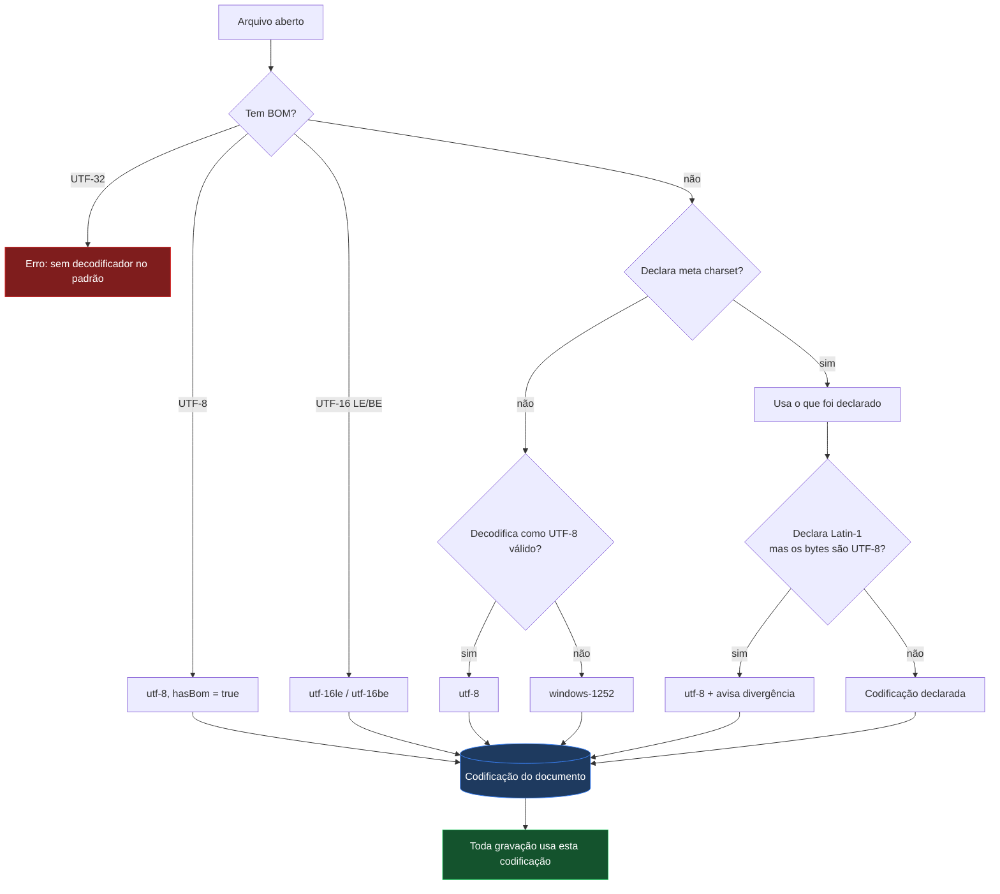

# CEJ-PAGE

**Português (Brasil)** · [English](README.en.md)

Editor visual de HTML que roda no navegador, criado para editar documentos
legados em **ISO-8859-1 / Windows-1252** sem corrompê-los.

---

## Sobre o projeto

Atos normativos publicados pelo Planalto e sistemas correlatos são páginas HTML
antigas, quase sempre exportadas do Word e codificadas em Windows-1252. Editá-las
em ferramentas modernas costuma destruí-las de duas formas: o arquivo é gravado
em UTF-8 enquanto continua declarando `charset=windows-1252` — e todo acento vira
mojibake — ou o editor reformata o documento inteiro, transformando uma correção
de uma linha num diff de mil linhas.

O CEJ-PAGE existe para editar esses arquivos como se fosse um editor visual
comum, sem que o arquivo pague o preço.

### Objetivos

| Objetivo | Como é atendido |
| --- | --- |
| Preservar a codificação original | A codificação detectada na abertura vira propriedade do documento e governa toda gravação |
| Preservar o arquivo fora da região editada | O `<head>` e todo trecho não tocado são copiados literalmente do original |
| Ser usável por quem não é da área técnica | Executável único para Windows: duplo clique, sem instalação |
| Funcionar em rede corporativa restrita | Zero dependências externas em tempo de execução; roda offline |
| Não expor os documentos | Tudo roda localmente; nenhum arquivo sai da máquina |

### Funcionalidades

- **Edição visual** — clicar para selecionar, arrastar para reordenar, clique
  duplo para editar texto no lugar.
- **Gravação direta no disco** — vínculo persistente com o arquivo via File
  System Access API; `Ctrl+S` grava por cima.
- **Codificação preservada** — detecção por BOM, `<meta charset>` ou análise dos
  bytes; gravação byte a byte na mesma codificação, com selo na barra e conversão
  UTF-8 ↔ ISO-8859-1 sob demanda.
- **Modo código** — CodeMirror 6 com realce de HTML, para controle fino.
- **Biblioteca de 45 blocos** em 9 categorias, arrastáveis para o documento.
- **Árvore DOM** navegável, com arrastar para reordenar.
- **Painel de propriedades** — tipografia, layout, espaçamento, fundo, borda,
  efeitos, classes, atributos e HTML bruto.
- **Comparação** com a versão em disco e com o `HEAD` do Git.
- **Desfazer/refazer**, autosave, snippets reutilizáveis e arquivos recentes.
- **Pré-visualização** por dispositivo (desktop / tablet / celular) e modo limpo.
- **Temas claro e escuro**, interface em português e inglês.

---

## Quick-Start

### Usar no Windows (usuário final)

1. Baixe o `CEJ-PAGE.exe` em [Releases](https://github.com/waldeyr/cej-page/releases).
2. Dê **duplo clique**.
3. O editor abre no navegador. **Para encerrar, feche a janela preta.**

Sem instalação, sem privilégio de administrador, sem internet.

> Na primeira execução o Windows pode exibir *"O Windows protegeu o seu
> computador"*, porque o arquivo não tem assinatura digital paga. Clique em
> **Mais informações** → **Executar assim mesmo**.

### Rodar a partir do código

É um site estático, sem etapa de build e sem dependências a instalar.

```sh
git clone https://github.com/waldeyr/cej-page.git
cd cej-page
python3 -m http.server 8000        # ou: npx serve .
```

Abra `http://localhost:8000`. `localhost` conta como contexto seguro, então a
gravação direta em disco funciona também em desenvolvimento.

### Gerar o executável

Pelo GitHub Actions (recomendado — não exige nada instalado): aba **Actions** →
**Build Windows executable** → **Run workflow**. O `.exe` fica anexado ao
resultado.

Localmente, com Go 1.24 ou superior:

```sh
./tools/launcher/build.sh          # dist/CEJ-PAGE.exe
./tools/launcher/build.sh host     # binário para a máquina atual
```

### Verificar

```sh
for f in js/*.js; do node --check "$f"; done
```

---

## Arquitetura

### Diagrama de componentes


Os módulos são JavaScript puro, sem empacotador. Cada um expõe um objeto único
em `window` (`window.Canvas`, `window.EditorState`, `window.Encoding`…) e as
mudanças de estado circulam por `EditorState.emit/on`. Em laranja, o caminho
crítico de codificação.

### Fluxo: abrir → editar → salvar


### Fluxo: decisão de codificação



### Funcionalidades e regras

| Funcionalidade | Regra de funcionamento |
| --- | --- |
| Abrir arquivo local | Vínculo persistente via File System Access API. Exige Chrome, Edge ou outro navegador Chromium em contexto seguro. |
| Importar HTML | Alternativa somente leitura para Safari e Firefox; salvar vira download. |
| Salvar (`Ctrl+S`) | Grava na codificação do documento. Antes de escrever compara o mtime do disco; se outro processo alterou o arquivo, pede confirmação. |
| Salvar como | **Mantém** a codificação do documento — a cópia de um arquivo Latin-1 também é Latin-1. |
| Novo documento em branco | Sempre UTF-8; não herda a codificação do arquivo anterior. |
| Detecção de codificação | Precedência: BOM → `<meta charset>` → análise dos bytes com `TextDecoder` estrito. Sem declaração e sem UTF-8 válido, assume Windows-1252. |
| Gravação | Sempre `Uint8Array`. Gravar uma string pela File System Access API produz UTF-8 por especificação — é a origem do bug que o projeto corrige. |
| Caracteres fora da codificação | Cascata: tabela de transliteração (`→`→`->`, 🙂→`:-)`), remoção de diacrítico (`ș`→`s`), referência numérica (`漢`→`&#28450;`). Dentro de `<script>`/`<style>` usa escape da linguagem, porque ali referências HTML não são interpretadas. |
| Aspas curvas, travessões, reticências | **Não** são transliterados: existem nativamente no Windows-1252 e são gravados com o mesmo byte de origem. |
| Conversão pelo selo | Move os bytes e a `<meta charset>` juntos, e marca o documento como alterado. |
| Preservação do `<head>` | Se a serialização do documento não diverge do original, a fonte é devolvida literalmente. Divergindo, apenas o trecho alterado é encaixado no original. |
| Modo Visual | Pode normalizar a formatação da marcação ao salvar, quando há edição. |
| Modo Código | CodeMirror; o conteúdo é gravado exatamente como está no buffer. |
| Desfazer/refazer | Snapshots do documento inteiro, limitados a 50 entradas ou ~8 MB. |
| Autosave | `localStorage`, 2 s após a última alteração. Oferecido como "Restaurar última sessão" na tela inicial. |
| Arquivos recentes | Últimos 8, por nome. |
| Comparação com o disco / Git | Decodifica o outro lado com a mesma codificação do documento, para não exibir mojibake como diferença. |
| Imagens locais | Resolvidas por pasta escolhida pelo usuário e exibidas via `blob:`; os atributos originais são restaurados ao salvar. |
| Pré-visualização | Desktop (largura total), tablet (820 px), celular (400 px). |
| Idioma | pt-BR por padrão; alternável para inglês, preferência persistida. |
| Privacidade | Nenhuma requisição de rede em tempo de execução. Nenhum arquivo sai da máquina. |

### Atalhos de teclado

| Atalho | Ação |
| --- | --- |
| `Ctrl+S` | Salvar no arquivo vinculado (ou exportar) |
| `Ctrl+Shift+S` | Salvar como |
| `Ctrl+Z` / `Ctrl+Shift+Z` / `Ctrl+Y` | Desfazer / refazer |
| `Ctrl+D` | Duplicar seleção |
| `Delete` / `Backspace` | Excluir seleção |
| `Ctrl+↑` / `Ctrl+↓` | Mover seleção para cima / baixo |
| `Esc` | Sair da pré-visualização, ou desselecionar |
| `P` | Alternar pré-visualização |
| Clique duplo | Editar texto no lugar |
| `A` `B` `C` `R` | Na tela inicial: abrir, importar, começar em branco, restaurar |

### Tecnologias e versões

| Tecnologia | Versão | Papel | Origem |
| --- | --- | --- | --- |
| JavaScript (ES2022) | — | Toda a aplicação; sem framework e sem empacotador | — |
| File System Access API | — | Vínculo e gravação no disco local | Nativa do navegador |
| `TextDecoder` / `TextEncoder` | — | Base da decodificação; a codificação Windows-1252 é implementada no projeto | Nativa do navegador |
| CodeMirror | 6.0.1 | Editor do modo código | `vendor/esm/` |
| @codemirror/state | 6.4.1 | Estado do editor de código | `vendor/esm/` |
| @codemirror/view | 6.26.3 | Renderização do editor de código | `vendor/esm/` |
| @codemirror/lang-html | 6.4.9 | Realce de sintaxe HTML | `vendor/esm/` |
| @codemirror/theme-one-dark | 6.1.2 | Tema escuro do modo código | `vendor/esm/` |
| diff | 5.2.0 | Comparação textual | `vendor/esm/` |
| isomorphic-git | 1.27.2 | Leitura do `HEAD` do repositório | `vendor/esm/` |
| Lucide | 1.28.0 | Ícones da interface | `vendor/lucide.min.js` |
| Roboto | — | Tipografia (9 subconjuntos woff2) | `vendor/fonts/` |
| Go | 1.24+ | Launcher que gera o `CEJ-PAGE.exe` | `tools/launcher/` |
| GitHub Actions | — | Compilação do executável e publicação no Pages | `.github/workflows/` |

Todas as bibliotecas ficam em [vendor/](vendor/) e são servidas pela própria
aplicação. **Nenhuma requisição sai para a internet em tempo de execução** — é o
que permite o funcionamento offline e dentro de redes restritas. Reintroduzir uma
referência a CDN faz o workflow de release falhar.

### Estrutura de diretórios

```
index.html              casca do editor (barra + 3 painéis + rodapé)
css/editor.css          estilos, temas claro e escuro
js/i18n.js              textos pt-BR / en (pt-BR é o padrão)
js/encoding.js          detecção de codificação e gravação byte a byte
js/state.js             estado global, desfazer/refazer, autosave, snippets
js/blocks.js            biblioteca de 45 componentes
js/canvas.js            iframe, seleção, arrastar e soltar
js/tree.js              painel da árvore DOM e breadcrumbs
js/properties.js        abas de estilo, atributos e HTML
js/blocks-panel.js      barra lateral de blocos e snippets
js/asset-resolver.js    resolução de imagens locais na pré-visualização
js/mode-switch.js       alternância Visual ⇄ Código
js/source.js            integração com o CodeMirror
js/file.js              abrir, salvar, salvar como, exportar
js/diff.js              comparação com a versão em disco
js/git.js               comparação com o HEAD do Git
js/keyboard.js          atalhos globais
js/editor.js            inicialização e ligação da interface
js/dialog.js            diálogos de confirmação e entrada
js/version.js           selo de versão do build
vendor/                 bibliotecas embutidas (funcionamento offline)
tools/launcher/         programa Go que gera o CEJ-PAGE.exe
```

---

## Fork

Este projeto é um fork de
**[mncoleman/html-editor](https://github.com/mncoleman/html-editor)**, criado por
**[Matthew Coleman](https://mncoleman.com/)**.

O editor visual original — o canvas em iframe, a árvore DOM, o painel de
propriedades, a biblioteca de blocos e a integração com a File System Access API —
é trabalho dele, publicado sob licença MIT. Nossa gratidão pelo projeto e por
disponibilizá-lo abertamente; sem essa base, o CEJ-PAGE não existiria.

O que este fork acrescentou: preservação de codificação legada, tradução para
português, redução da interface ao essencial, eliminação das dependências
externas e o executável portátil para Windows.

## Licença

[MIT](LICENSE) — mantida do projeto original, com o aviso de copyright
correspondente preservado.
