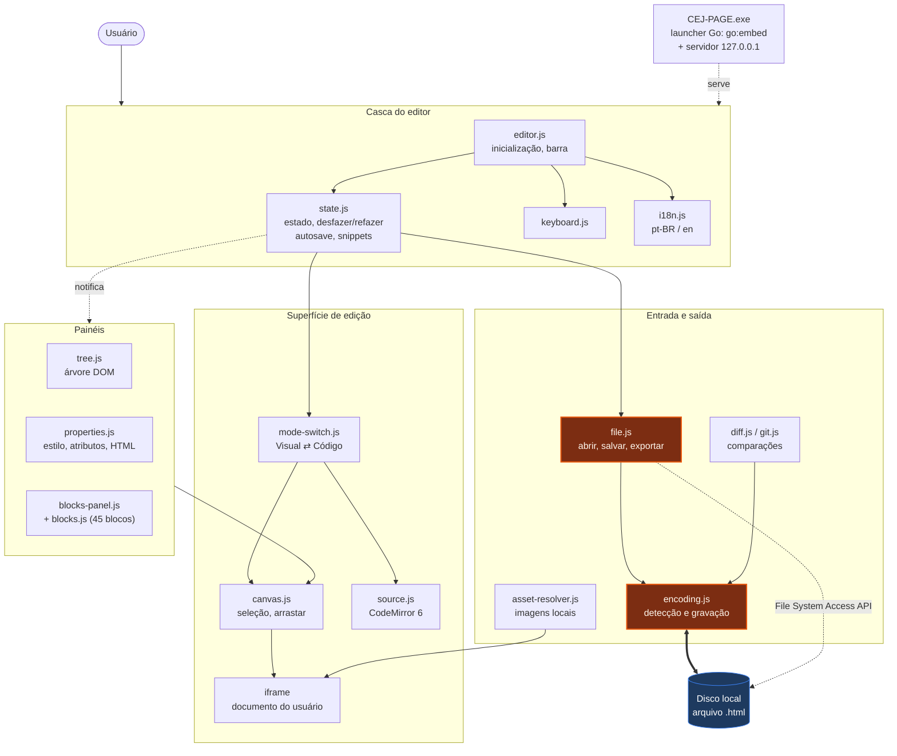
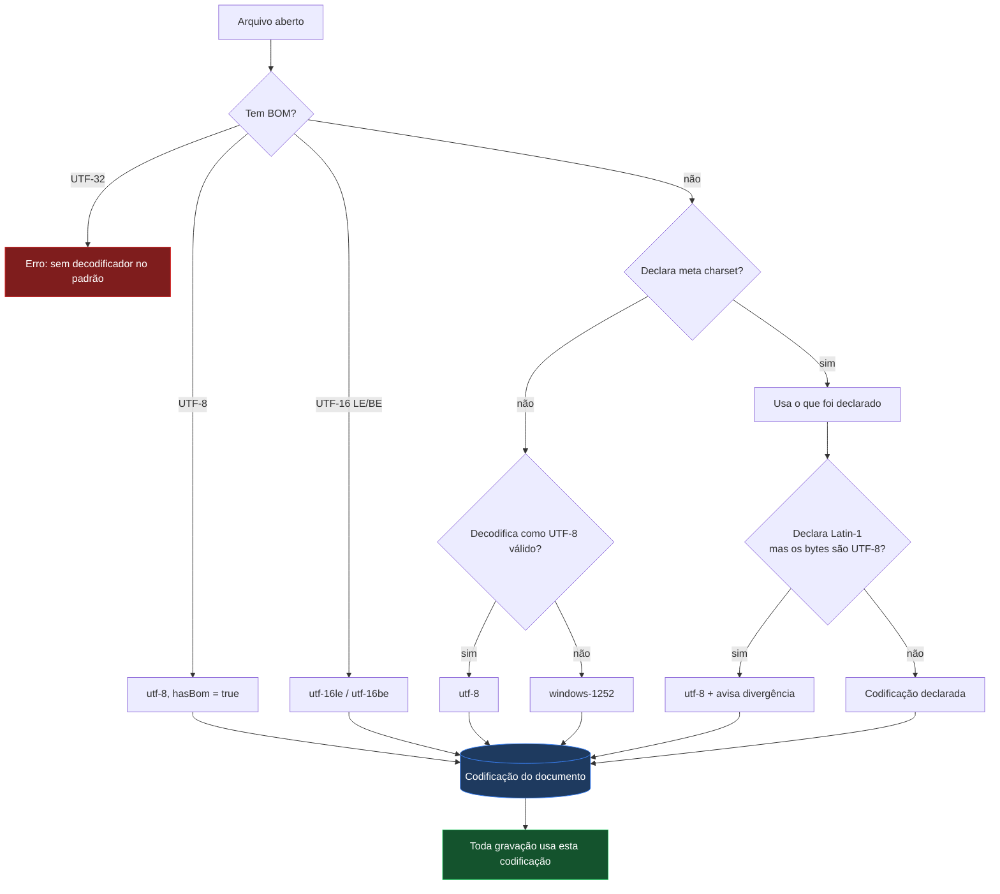
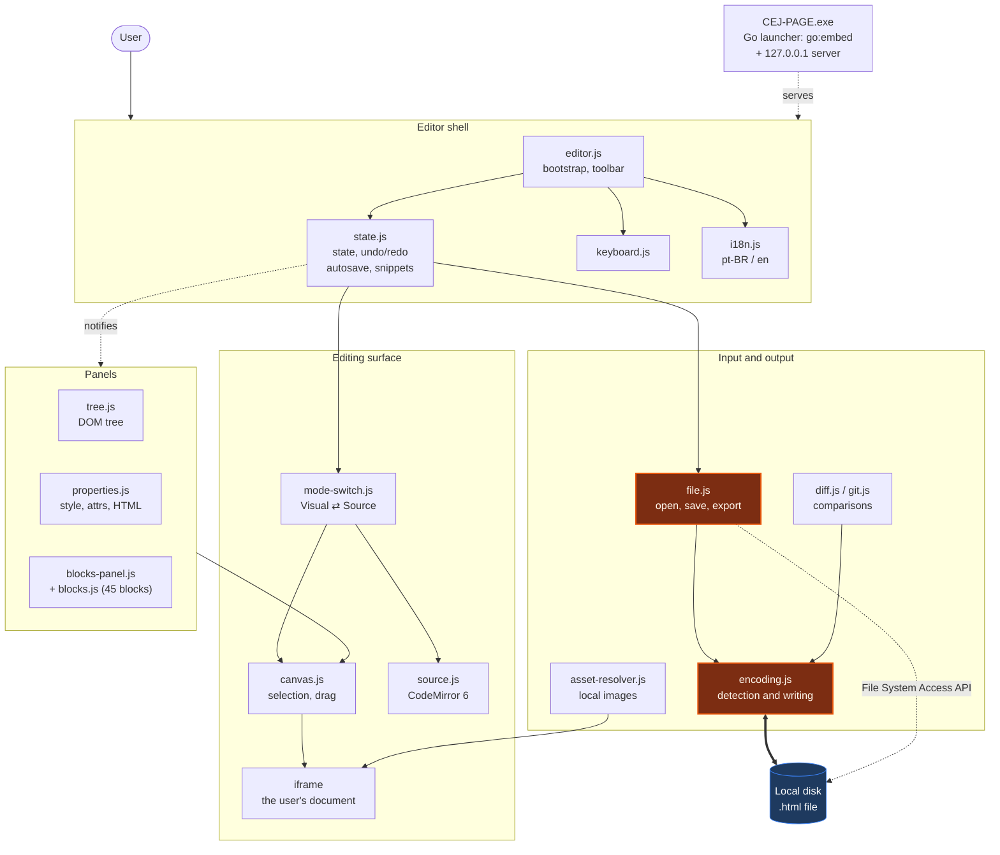
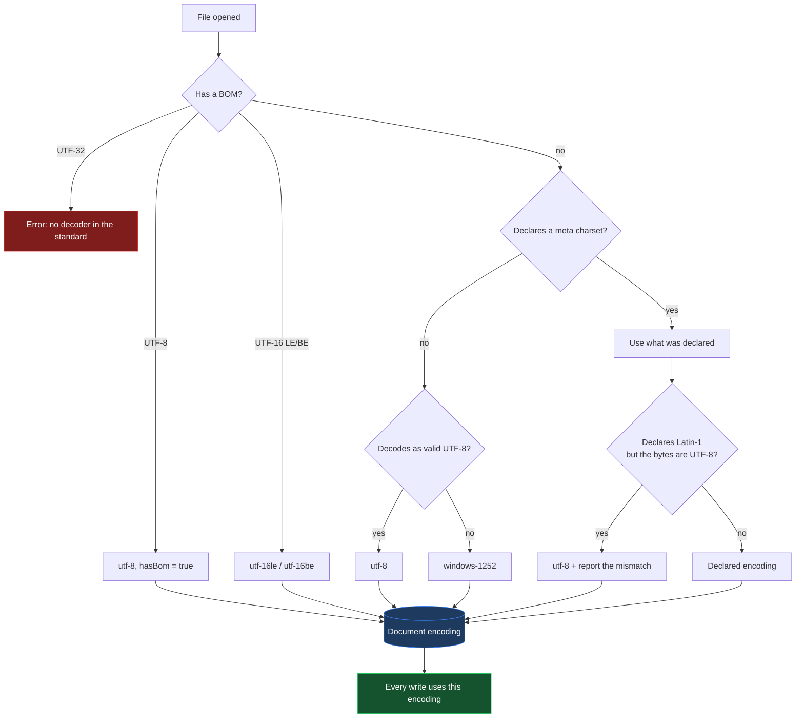

# CEJ-PAGE

[](LICENSE)
[](https://github.com/waldeyr/cej-editor/releases)
[](#tecnologias-e-versões)
[](#fluxo-decisão-de-codificação)

Editor visual de HTML que roda no navegador, criado para editar documentos
legados em **ISO-8859-1 / Windows-1252** sem corrompê-los.

---

## Sobre o projeto

Atos normativos publicados pelo Planalto e sistemas correlatos são páginas HTML
antigas, quase sempre exportadas do Word e codificadas em Windows-1252. Editá-las
em ferramentas modernas costuma destruí-las de duas formas: o arquivo é gravado
em UTF-8 enquanto continua declarando `charset=windows-1252` — e todo acento vira
mojibake — ou o editor reformata o documento inteiro, transformando uma correção
de uma linha num diff de mil linhas.

O CEJ-PAGE existe para editar esses arquivos como se fosse um editor visual
comum, sem que o arquivo pague o preço.

### Objetivos

| Objetivo | Como é atendido |
| --- | --- |
| Preservar a codificação original | A codificação detectada na abertura vira propriedade do documento e governa toda gravação |
| Preservar o arquivo fora da região editada | O `<head>` e todo trecho não tocado são copiados literalmente do original |
| Ser usável por quem não é da área técnica | Executável único para Windows: duplo clique, sem instalação |
| Funcionar em rede corporativa restrita | Zero dependências externas em tempo de execução; roda offline |
| Não expor os documentos | Tudo roda localmente; nenhum arquivo sai da máquina |

### Funcionalidades

- **Edição visual** — clicar para selecionar, arrastar para reordenar, clique
  duplo para editar texto no lugar.
- **Gravação direta no disco** — vínculo persistente com o arquivo via File
  System Access API; `Ctrl+S` grava por cima.
- **Codificação preservada** — detecção por BOM, `<meta charset>` ou análise dos
  bytes; gravação byte a byte na mesma codificação, com selo na barra e conversão
  UTF-8 ↔ ISO-8859-1 sob demanda.
- **Modo código** — CodeMirror 6 com realce de HTML, para controle fino.
- **Biblioteca de 45 blocos** em 9 categorias, arrastáveis para o documento.
- **Árvore DOM** navegável, com arrastar para reordenar.
- **Painel de propriedades** — tipografia, layout, espaçamento, fundo, borda,
  efeitos, classes, atributos e HTML bruto.
- **Comparação** com a versão em disco e com o `HEAD` do Git.
- **Desfazer/refazer**, autosave, snippets reutilizáveis e arquivos recentes.
- **Pré-visualização** por dispositivo (desktop / tablet / celular) e modo limpo.
- **Temas claro e escuro**, interface em português e inglês.

---

## Quick-Start

### Usar no Windows (usuário final)

1. Baixe o `CEJ-PAGE.exe` em [Releases](https://github.com/waldeyr/cej-editor/releases).
2. Dê **duplo clique**.
3. O editor abre no navegador. **Para encerrar, feche a janela preta.**

Sem instalação, sem privilégio de administrador, sem internet.

> Na primeira execução o Windows pode exibir *"O Windows protegeu o seu
> computador"*, porque o arquivo não tem assinatura digital paga. Clique em
> **Mais informações** → **Executar assim mesmo**.

### Rodar depois de clonar

É um site estático: não há etapa de build, nem dependências a instalar. Basta
servir a pasta por HTTP e abrir no navegador.

```sh
git clone https://github.com/waldeyr/cej-editor.git
cd cej-editor
```

Escolha **qualquer uma** destas — use a que já estiver na sua máquina:

| Se você tem | Comando |
| --- | --- |
| Python 3 | `python3 -m http.server 8000` |
| Node.js | `npx serve . -l 8000` |
| PHP | `php -S localhost:8000` |
| Ruby | `ruby -run -e httpd . -p 8000` |
| Go 1.24+ | `./tools/launcher/build.sh host && ./dist/cej-page` |
| VS Code | extensão *Live Server* → botão **Go Live** |

Depois abra `http://localhost:8000`.

> **Não abra o `index.html` com duplo clique.** Em `file://` o navegador
> bloqueia a File System Access API (a gravação em disco) e não resolve o
> importmap dos módulos. Já `http://localhost` conta como contexto seguro,
> então servindo a pasta tudo funciona, inclusive salvar direto no arquivo.

Qualquer servidor estático serve, desde que entregue arquivos `.mjs` com um
tipo MIME de JavaScript — os seis acima foram verificados. Um servidor que
devolva `.mjs` como `text/plain` faz o navegador recusar os módulos
carregados sob demanda, quebrando o modo código e as comparações.

### Gerar o executável

Pelo GitHub Actions (recomendado — não exige nada instalado): aba **Actions** →
**Build Windows executable** → **Run workflow**. O `.exe` fica anexado ao
resultado.

Localmente, com Go 1.24 ou superior (`brew install go`):

```sh
./tools/launcher/build.sh          # dist/CEJ-PAGE.exe
./tools/launcher/build.sh host     # binário para a máquina atual
```

O Go é necessário **apenas** para gerar o executável — não para rodar o editor.

### Verificar

```sh
for f in js/*.js; do node --check "$f"; done
```

---

## Arquitetura

### Diagrama de componentes



Os módulos são JavaScript puro, sem empacotador. Cada um expõe um objeto único
em `window` (`window.Canvas`, `window.EditorState`, `window.Encoding`…) e as
mudanças de estado circulam por `EditorState.emit/on`. Em laranja, o caminho
crítico de codificação.

### Fluxo: abrir → editar → salvar


### Fluxo: decisão de codificação



### Funcionalidades e regras

| Funcionalidade | Regra de funcionamento |
| --- | --- |
| Abrir arquivo local | Vínculo persistente via File System Access API. Exige Chrome, Edge ou outro navegador Chromium em contexto seguro. |
| Importar HTML | Alternativa somente leitura para Safari e Firefox; salvar vira download. |
| Salvar (`Ctrl+S`) | Grava na codificação do documento. Antes de escrever compara o mtime do disco; se outro processo alterou o arquivo, pede confirmação. |
| Salvar como | **Mantém** a codificação do documento — a cópia de um arquivo Latin-1 também é Latin-1. |
| Novo documento em branco | Sempre UTF-8; não herda a codificação do arquivo anterior. |
| Detecção de codificação | Precedência: BOM → `<meta charset>` → análise dos bytes com `TextDecoder` estrito. Sem declaração e sem UTF-8 válido, assume Windows-1252. |
| Gravação | Sempre `Uint8Array`. Gravar uma string pela File System Access API produz UTF-8 por especificação — é a origem do bug que o projeto corrige. |
| Caracteres fora da codificação | Cascata: tabela de transliteração (`→`→`->`, 🙂→`:-)`), remoção de diacrítico (`ș`→`s`), referência numérica (`漢`→`&#28450;`). Dentro de `<script>`/`<style>` usa escape da linguagem, porque ali referências HTML não são interpretadas. |
| Aspas curvas, travessões, reticências | **Não** são transliterados: existem nativamente no Windows-1252 e são gravados com o mesmo byte de origem. |
| Conversão pelo selo | Move os bytes e a `<meta charset>` juntos, e marca o documento como alterado. |
| Preservação do `<head>` | Se a serialização do documento não diverge do original, a fonte é devolvida literalmente. Divergindo, apenas o trecho alterado é encaixado no original. |
| Modo Visual | Pode normalizar a formatação da marcação ao salvar, quando há edição. |
| Modo Código | CodeMirror; o conteúdo é gravado exatamente como está no buffer. |
| Desfazer/refazer | Snapshots do documento inteiro, limitados a 50 entradas ou ~8 MB. |
| Autosave | `localStorage`, 2 s após a última alteração. Oferecido como "Restaurar última sessão" na tela inicial. |
| Arquivos recentes | Últimos 8, por nome. |
| Comparação com o disco / Git | Decodifica o outro lado com a mesma codificação do documento, para não exibir mojibake como diferença. |
| Imagens locais | Resolvidas por pasta escolhida pelo usuário e exibidas via `blob:`; os atributos originais são restaurados ao salvar. |
| Pré-visualização | Desktop (largura total), tablet (820 px), celular (400 px). |
| Idioma | pt-BR por padrão; alternável para inglês, preferência persistida. |
| Privacidade | Nenhuma requisição de rede em tempo de execução. Nenhum arquivo sai da máquina. |

### Atalhos de teclado

| Atalho | Ação |
| --- | --- |
| `Ctrl+S` | Salvar no arquivo vinculado (ou exportar) |
| `Ctrl+Shift+S` | Salvar como |
| `Ctrl+Z` / `Ctrl+Shift+Z` / `Ctrl+Y` | Desfazer / refazer |
| `Ctrl+D` | Duplicar seleção |
| `Delete` / `Backspace` | Excluir seleção |
| `Ctrl+↑` / `Ctrl+↓` | Mover seleção para cima / baixo |
| `Esc` | Sair da pré-visualização, ou desselecionar |
| `P` | Alternar pré-visualização |
| Clique duplo | Editar texto no lugar |
| `A` `B` `C` `R` | Na tela inicial: abrir, importar, começar em branco, restaurar |

### Tecnologias e versões

| Tecnologia | Versão | Papel | Origem |
| --- | --- | --- | --- |
| JavaScript (ES2022) | — | Toda a aplicação; sem framework e sem empacotador | — |
| File System Access API | — | Vínculo e gravação no disco local | Nativa do navegador |
| `TextDecoder` / `TextEncoder` | — | Base da decodificação; a codificação Windows-1252 é implementada no projeto | Nativa do navegador |
| CodeMirror | 6.0.1 | Editor do modo código | `vendor/esm/` |
| @codemirror/state | 6.4.1 | Estado do editor de código | `vendor/esm/` |
| @codemirror/view | 6.26.3 | Renderização do editor de código | `vendor/esm/` |
| @codemirror/lang-html | 6.4.9 | Realce de sintaxe HTML | `vendor/esm/` |
| @codemirror/theme-one-dark | 6.1.2 | Tema escuro do modo código | `vendor/esm/` |
| diff | 5.2.0 | Comparação textual | `vendor/esm/` |
| isomorphic-git | 1.27.2 | Leitura do `HEAD` do repositório | `vendor/esm/` |
| Lucide | 1.28.0 | Ícones da interface | `vendor/lucide.min.js` |
| Roboto | — | Tipografia (9 subconjuntos woff2) | `vendor/fonts/` |
| Go | 1.24+ | Launcher que gera o `CEJ-PAGE.exe` | `tools/launcher/` |
| GitHub Actions | — | Compilação do executável e publicação no Pages | `.github/workflows/` |

Todas as bibliotecas ficam em [vendor/](vendor/) e são servidas pela própria
aplicação. **Nenhuma requisição sai para a internet em tempo de execução** — é o
que permite o funcionamento offline e dentro de redes restritas. Reintroduzir uma
referência a CDN faz o workflow de release falhar.

### Estrutura de diretórios

```
index.html              casca do editor (barra + 3 painéis + rodapé)
css/editor.css          estilos, temas claro e escuro
js/i18n.js              textos pt-BR / en (pt-BR é o padrão)
js/encoding.js          detecção de codificação e gravação byte a byte
js/state.js             estado global, desfazer/refazer, autosave, snippets
js/blocks.js            biblioteca de 45 componentes
js/canvas.js            iframe, seleção, arrastar e soltar
js/tree.js              painel da árvore DOM e breadcrumbs
js/properties.js        abas de estilo, atributos e HTML
js/blocks-panel.js      barra lateral de blocos e snippets
js/asset-resolver.js    resolução de imagens locais na pré-visualização
js/mode-switch.js       alternância Visual ⇄ Código
js/source.js            integração com o CodeMirror
js/file.js              abrir, salvar, salvar como, exportar
js/diff.js              comparação com a versão em disco
js/git.js               comparação com o HEAD do Git
js/keyboard.js          atalhos globais
js/editor.js            inicialização e ligação da interface
js/dialog.js            diálogos de confirmação e entrada
js/version.js           selo de versão do build
vendor/                 bibliotecas embutidas (funcionamento offline)
tools/launcher/         programa Go que gera o CEJ-PAGE.exe
```

---

## Fork

Este projeto é um fork de
**[mncoleman/html-editor](https://github.com/mncoleman/html-editor)**, criado por
**[Matthew Coleman](https://mncoleman.com/)**.

O editor visual original — o canvas em iframe, a árvore DOM, o painel de
propriedades, a biblioteca de blocos e a integração com a File System Access API —
é trabalho dele, publicado sob licença MIT. Nossa gratidão pelo projeto e por
disponibilizá-lo abertamente; sem essa base, o CEJ-PAGE não existiria.

O que este fork acrescentou: preservação de codificação legada, tradução para
português, redução da interface ao essencial, eliminação das dependências
externas e o executável portátil para Windows.

## Licença

[MIT](LICENSE) — mantida do projeto original, com o aviso de copyright
correspondente preservado.


---

<details>
<summary><b>&nbsp;🇬🇧&nbsp; English version</b> &nbsp;— click to expand</summary>

<br>

A browser-based visual HTML editor, built to edit legacy **ISO-8859-1 /
Windows-1252** documents without corrupting them.

---

## About

Brazilian federal legislation published by the *Planalto* and related systems
consists of old HTML pages, nearly all exported from Word and encoded in
Windows-1252. Modern tools tend to destroy them in one of two ways: the file is
written back as UTF-8 while still declaring `charset=windows-1252` — turning
every accented character into mojibake — or the editor reformats the whole
document, turning a one-line correction into a thousand-line diff.

CEJ-PAGE exists so those files can be edited like any other page, without the
file paying for it.

### Goals

| Goal | How it's met |
| --- | --- |
| Preserve the original encoding | The encoding detected on open becomes a property of the document and governs every write |
| Preserve the file outside the edited region | The `<head>` and every untouched span are copied verbatim from the original |
| Usable by non-technical staff | Single-file Windows executable: double-click, no installation |
| Work on a locked-down corporate network | Zero runtime dependencies; runs fully offline |
| Keep documents private | Everything runs locally; no file ever leaves the machine |

### Features

- **Visual editing** — click to select, drag to reorder, double-click to edit
  text in place.
- **Live save to disk** — a persistent handle to the file via the File System
  Access API; `Ctrl+S` writes straight back.
- **Encoding preserved** — detection by BOM, `<meta charset>` or byte analysis;
  byte-exact writing in the same encoding, with a toolbar chip and on-demand
  UTF-8 ↔ ISO-8859-1 conversion.
- **Source mode** — CodeMirror 6 with HTML highlighting, for fine control.
- **45 pre-built blocks** across 9 categories, draggable into the document.
- **DOM tree** panel with drag-to-reorder.
- **Properties panel** — typography, layout, spacing, background, border,
  effects, classes, attributes and raw HTML.
- **Diff** against the on-disk version and against Git `HEAD`.
- **Undo/redo**, autosave, reusable snippets and recent files.
- **Device preview** (desktop / tablet / mobile) and a clean preview mode.
- **Light and dark themes**, interface in Portuguese and English.

---

## Quick start

### Running on Windows (end user)

1. Download `CEJ-PAGE.exe` from [Releases](https://github.com/waldeyr/cej-editor/releases).
2. **Double-click** it.
3. The editor opens in your browser. **To stop it, close the black window.**

No installation, no administrator rights, no internet.

> On first run Windows may show *"Windows protected your PC"*, because the file
> carries no paid code-signing certificate. Click **More info** → **Run anyway**.

### Running after cloning

It's a static site: no build step, nothing to install. Serve the folder over
HTTP and open it in a browser.

```sh
git clone https://github.com/waldeyr/cej-editor.git
cd cej-editor
```

Pick **any one** of these — whichever you already have:

| If you have | Command |
| --- | --- |
| Python 3 | `python3 -m http.server 8000` |
| Node.js | `npx serve . -l 8000` |
| PHP | `php -S localhost:8000` |
| Ruby | `ruby -run -e httpd . -p 8000` |
| Go 1.24+ | `./tools/launcher/build.sh host && ./dist/cej-page` |
| VS Code | *Live Server* extension → **Go Live** |

Then open `http://localhost:8000`.

> **Don't open `index.html` by double-clicking it.** Under `file://` the browser
> blocks the File System Access API (saving to disk) and won't resolve the module
> importmap. `http://localhost` counts as a secure context, so serving the folder
> makes everything work, saving included.

Any static server will do, as long as it serves `.mjs` files with a JavaScript
MIME type — the six above were verified. A server that returns `.mjs` as
`text/plain` makes the browser refuse the lazily-loaded modules, breaking source
mode and the diff views.

### Building the executable

Via GitHub Actions (recommended — nothing to install): **Actions** tab →
**Build Windows executable** → **Run workflow**. The `.exe` is attached to the
run.

Locally, with Go 1.24 or newer (`brew install go`):

```sh
./tools/launcher/build.sh          # dist/CEJ-PAGE.exe
./tools/launcher/build.sh host     # binary for the current machine
```

Go is needed **only** to produce the executable — not to run the editor.

### Checking

```sh
for f in js/*.js; do node --check "$f"; done
```

---

## Architecture

### Component diagram



Modules are plain JavaScript with no bundler. Each exposes a single object on
`window` (`window.Canvas`, `window.EditorState`, `window.Encoding`…) and state
changes flow through `EditorState.emit/on`. The critical encoding path is
highlighted in orange.

### Flow: open → edit → save


### Flow: encoding decision



### Features and rules

| Feature | Rule |
| --- | --- |
| Open local file | Persistent handle via the File System Access API. Requires Chrome, Edge or another Chromium browser in a secure context. |
| Import HTML | Read-only fallback for Safari and Firefox; saving becomes a download. |
| Save (`Ctrl+S`) | Writes in the document's encoding. Compares the on-disk mtime first; if another process changed the file, asks for confirmation. |
| Save as | **Keeps** the document's encoding — a copy of a Latin-1 file is Latin-1 too. |
| New blank document | Always UTF-8; never inherits the previous file's encoding. |
| Encoding detection | Precedence: BOM → `<meta charset>` → byte analysis with a strict `TextDecoder`. Undeclared and not valid UTF-8 means Windows-1252. |
| Writing | Always a `Uint8Array`. Writing a string through the File System Access API produces UTF-8 by spec — the exact bug this project fixes. |
| Characters outside the charset | Cascade: transliteration table (`→`→`->`, 🙂→`:-)`), diacritic folding (`ș`→`s`), numeric reference (`漢`→`&#28450;`). Inside `<script>`/`<style>` a language escape is used instead, since HTML references aren't parsed there. |
| Curly quotes, dashes, ellipsis | **Not** transliterated: they exist natively in Windows-1252 and are written back as their original byte. |
| Conversion via the chip | Moves the bytes and the `<meta charset>` together, and marks the document dirty. |
| `<head>` preservation | If the document's serialization doesn't diverge from the original, the source is returned verbatim. When it does, only the changed span is spliced into the original. |
| Visual mode | May normalize markup formatting on save, once edited. |
| Source mode | CodeMirror; content is written exactly as it stands in the buffer. |
| Undo/redo | Whole-document snapshots, capped at 50 entries or ~8 MB. |
| Autosave | `localStorage`, 2 s after the last change. Offered as "restore last session" on the empty screen. |
| Recent files | Last 8, by name. |
| Diff against disk / Git | Decodes the other side with the document's encoding, so mojibake isn't reported as a difference. |
| Local images | Resolved from a user-chosen folder and shown via `blob:`; original attributes are restored on save. |
| Preview | Desktop (full width), tablet (820 px), mobile (400 px). |
| Language | pt-BR by default; switchable to English, preference persisted. |
| Privacy | No network requests at runtime. No file leaves the machine. |

### Keyboard shortcuts

| Shortcut | Action |
| --- | --- |
| `Ctrl+S` | Save to the linked file (or export) |
| `Ctrl+Shift+S` | Save as |
| `Ctrl+Z` / `Ctrl+Shift+Z` / `Ctrl+Y` | Undo / redo |
| `Ctrl+D` | Duplicate selection |
| `Delete` / `Backspace` | Delete selection |
| `Ctrl+↑` / `Ctrl+↓` | Move selection up / down |
| `Esc` | Exit preview, or deselect |
| `P` | Toggle preview |
| Double-click | Edit text in place |
| `A` `B` `C` `R` | On the empty screen: open, import, start blank, restore |

### Technologies and versions

| Technology | Version | Role | Source |
| --- | --- | --- | --- |
| JavaScript (ES2022) | — | The entire application; no framework, no bundler | — |
| File System Access API | — | Linking to and writing the local file | Browser native |
| `TextDecoder` / `TextEncoder` | — | Decoding foundation; Windows-1252 encoding is implemented in-project | Browser native |
| CodeMirror | 6.0.1 | Source-mode editor | `vendor/esm/` |
| @codemirror/state | 6.4.1 | Editor state | `vendor/esm/` |
| @codemirror/view | 6.26.3 | Editor rendering | `vendor/esm/` |
| @codemirror/lang-html | 6.4.9 | HTML syntax highlighting | `vendor/esm/` |
| @codemirror/theme-one-dark | 6.1.2 | Source-mode dark theme | `vendor/esm/` |
| diff | 5.2.0 | Text comparison | `vendor/esm/` |
| isomorphic-git | 1.27.2 | Reading the repository `HEAD` | `vendor/esm/` |
| Lucide | 1.28.0 | Interface icons | `vendor/lucide.min.js` |
| Roboto | — | Typography (9 woff2 subsets) | `vendor/fonts/` |
| Go | 1.24+ | Launcher that produces `CEJ-PAGE.exe` | `tools/launcher/` |
| GitHub Actions | — | Executable build and Pages deployment | `.github/workflows/` |

Every library lives in [vendor/](vendor/) and is served by the application
itself. **No request leaves for the internet at runtime** — that's what makes
offline and restricted-network operation possible. Reintroducing a CDN reference
fails the release workflow.

### Directory layout

```
index.html              editor shell (toolbar + 3 panes + status bar)
css/editor.css          styles, light and dark themes
js/i18n.js              pt-BR / en strings (pt-BR is the default)
js/encoding.js          charset detection and byte-exact writing
js/state.js             global state, undo/redo, autosave, snippets
js/blocks.js            library of 45 components
js/canvas.js            iframe, selection, drag and drop
js/tree.js              DOM tree panel and breadcrumbs
js/properties.js        style, attribute and HTML tabs
js/blocks-panel.js      blocks and snippets sidebar
js/asset-resolver.js    local image resolution in preview
js/mode-switch.js       Visual ⇄ Source switching
js/source.js            CodeMirror integration
js/file.js              open, save, save as, export
js/diff.js              diff against the on-disk version
js/git.js               diff against Git HEAD
js/keyboard.js          global shortcuts
js/editor.js            bootstrap and interface wiring
js/dialog.js            confirmation and input dialogs
js/version.js           build version chip
vendor/                 embedded dependencies (offline operation)
tools/launcher/         Go program that produces CEJ-PAGE.exe
```

---

## Fork

This project is a fork of
**[mncoleman/html-editor](https://github.com/mncoleman/html-editor)**, created by
**[Matthew Coleman](https://mncoleman.com/)**.

The original visual editor — the iframe canvas, the DOM tree, the properties
panel, the block library and the File System Access integration — is their work,
released under the MIT license. Our thanks for building it and for making it
openly available; without that foundation CEJ-PAGE would not exist.

What this fork adds: legacy encoding preservation, Portuguese translation, an
interface stripped to essentials, removal of all external dependencies, and the
portable Windows executable.

## License

[MIT](LICENSE) — carried over from the original project, with its copyright
notice preserved.

</details>
